aaaa冲oppo杯！

<!--more-->

# 第0章 -- Kotlin

### 变量

`val(value)`用于声明**不可变**变量

`var(variable)`用于声明**可变**变量

显式声明`Int`类型变量：`var:Int = 10`

tips:优先使用val声明一个变量，不够用时才用var

### 函数

示例：

```kotlin
fun methodName(param1:Int, param2:Int):Int{
	return 0
}
// 语法糖：
fun methodName(param1:Int, param2:Int) = max(param1,param2)
// 自动类型推导并省略函数体
```


### 逻辑语句

#### if

**与else一起使用时**可以有返回值，返回值为代码块中最后一行代码的返回值。

```kotlin
val value = if (num1 > num2){
	num1
}else {
	num2
}

fun getMin(a:Int,b:Int) = if (a < b) a else b
```

#### when

类似switch-case

```kotlin
fun getScore(name:String) = when (name){
	"Tommy"->86
	"Jimmy"->77
	"Jacky"->95
	else -> 0
}
```

`is` 类型判断

```kotlin
fun checkNum(num:Number) = when (num){
	is Int -> println("Int is incorrect")
    is Double -> ...
    else -> ,,,
}

fun checkNum(num:Number) = when {
	num is Int -> println("Int is incorrect")
    num is Double -> ...
    else -> ,,,
}
```

#### for

创建双端区间：`val range = 0..10`

创建单端闭区间：`val range = 0 until 10`

控制step：`val range = 0 until 10 step 2`

降序：`downTo`

#### 面向对象

```kotlin
class Person(name:String){
	var name = name
	fun eat(){
		println("eating")
	}
}
...
var p = Person()
//可继承:
open class Person(){
    ...
}
class Student: Person(){
    ...
}
```

为什么Person后要加括号？——主构函数和次构函数

主构函数：

```kotlin
class Person(name:String){
    init{
        println("name is"+ name)
    }
	var name = name
	fun eat(){
		println("eating")
	}
}
```

继承时：

```kotlin
open class Person(name:String){
	...
}
class Student(name:String) : Person(name){
	...
}
```

次构造函数：用于补充主构造函数

```kotlin
class Student(name:String,val grade:Int) : Person(name){
	constructor(name:String):this(name,0){}
}
```

数据类：

`data class Cellphone(val brand:String,val price:Double)`

自动生成`equals(),hashCode(),toStirng()`

单例类：(全局仅允许拥有一个实例)

`object class Singleton {}`

### Lambda编程

可变列表：`mutableListOf()`

不可变列表：`listOf()`

可用`for-in`遍历

set、map类似

#### lambda语法

`{参数名1：参数类型，参数名2：参数类型 -> 函数体}`

当只有一个参数时，参数名可以用it代替

`val maxLengthFruit =- list.maxBy {it.length}`

`val newList = list.filter {it.length <= 5} . map{it.toUpperCase()}`

`val anyResult = list.any {it.length <= 5}`

`val allResult = list.all {it.length <= 5 }`

### 空指针检查

Kotlin默认所有指针和变量不可空

如果希望传入参数可以为空

```kotlin
fun doStudy(study: Study?){
	if(study != null){
		...
	}
}
```

允许为空时必须要对空类型进行处理（if ...）

辅助判空工具（运算符）

```kotlin
fun doStudy(text: String?){
	text?.doSomething()
	text?.length ?: 0
}
```

`?.`运算符等价于上边的if判断

`?:`左边表达式不为空时返回左边表达式结果，否则返回右边表达式的结果

`!!`非空断言，告诉编译器前面的对象不会为空

`let()`函数：将调用let函数的对象本身作为参数传入函数中

```
fun doStudy(study: Study?){
	study.?let{ stu ->
		stu.readBooks()
		stu.doHomeWork()
	}
}
```

相比于用多个`?.`每次调用检查一次，`?.let`仅检查一次，效率更高

# 第一章

### 0.项目文件结构

项目结构模式

- Android模式：适合快速开发
- Project模式：真实文件结构

App目录下：

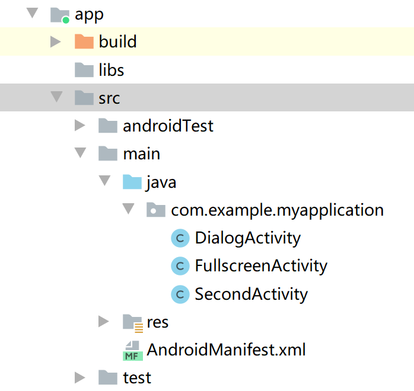

- libs：放置第三方jar包
- androidTest：编写test用例
- java：放置我们**编写的java代码**
- res：放置图片、布局、字符串等**资源**，用于解决多分辨率设备的兼容性问题
  - 只有一张图——放drawable-xxhdpi下
  - `R.string.hello_world`或者`@string/hello_world`方式都可以对res中的`strings.xml`的字符串进行引用
  - 同理，引用图片就是`@drawable`，引用图标就是`@mipmap`
  - `@+id/button_1`在xml中新定义一个id
- AndroidManifest.xml：（n.旅客名单）配置文件，用于注册组件（四大组件：Activity、Service、Content Provider、BroadcastReceiver），还可以给应用添加权限声明；
- test：用于编写Unit Test；
- proguard-rules.pro：用于指定打包时的混淆规则
- 逻辑与视图分离：布局文件都在`res/layout`路径下，通过`setContentView()`引用进来

### 1. 日志工具使用

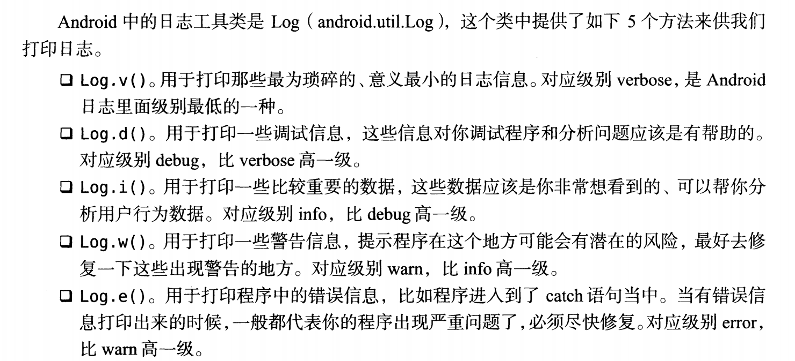

例如：`Log.d(tag:string, msg:string);`

第一个参数为tag，一般传入当前类名，用于对打印信息进行**过滤**；

第二个参数msg，即想输出的错误信息；

与`system.out.println()`区别在于**可控性**

小trick：在`onCreate`外面输入`logt`可以自动生成TAG常量（类名），避免每次手动输入的麻烦；

可以通过左下角Logcat系统进行日志过滤；

# 第二章

### 1. Activity活动

- 创建活动

  - 通过`setContentView()`加载布局
  - 在Manifest文件中注册（每次都会自动注册）\<application>标签内
  - 在\<activity>中加入\<intent-filter>，添加声明：

  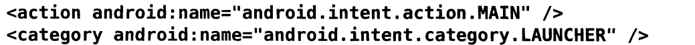从而将当前活动设置为主活动（打开app首先启动的活动）

- 添加Toast：

  - 布局中定义的元素可以通过`findViewById(@id/xx)`方法找到；方法本身返回一个**View对象**，可以向下转换为Button等对象；
  - button对象通过`setOnClickListener(Listener:View.OnClickListenter())`方法绑定监听器。
  - `Toast.makeText(context:Activity, msg:string, length:Toast.LENGTH_SHORT/Toast.LENGTH_LONG);`显示Toast内容

- 使用Menu：

  - 首先在res目录下新建一个menu文件夹，右键添加Menu源文件
  - 每个item通过id指定标识符，title表示项名称
  - 在活动中重写`onCreateOptionsMenu(menu:Menu)`、`onOptionsItemSelected(item:Menuitem)`方法。

- 销毁活动：

  - 自动销毁：back
  - 手动销毁：调用`finish()`方法

### 2. 使用Intent在活动中穿梭

- 显式intent：

  - 构造意图（intent）：`Intent(context:Context, cls:Class<?>)`第一个参数表示想要启动新活动的上下文，第二个参数表示目标活动
  - 通过`startActivity(intent)`实现意图

- 隐式intent：

  - **不明确指出**要启动的活动，只给出要启动的活动的要求（含蓄）

  - 当前活动能够相应的action和category等信息都在配置文件中的`intent-filter`（名称由来），只有**每种标签**都匹配上才能相应；

    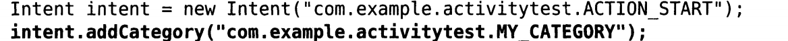

  - 还可以通过隐式Intent启动其他软件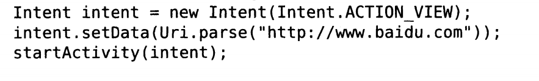

  - 还可以添加data标签，通过`setData()`方法传输数据；**只有data标签和intent携带的data完全一致时才会进行响应**。

  - 还可以通过intent的`putExtra(dataName:string, data)`向下一个Activity传递数据；用`intent = getIntent()+intent.getStringExtra(dataName)`取出。

  - 还可以通过`startActivityForResult(intent:Intent, code)`方法启动一个带有result存储器的活动，该活动通过`setResult(code, intent:Intent)`方法设置专门用于传输数据的intent，活动销毁之后，就可以通过原活动的`onActivityResult(requestCode, resultCode, data:Intent)`接受到下一个活动回传的数据。

    例子：

    原活动中：

    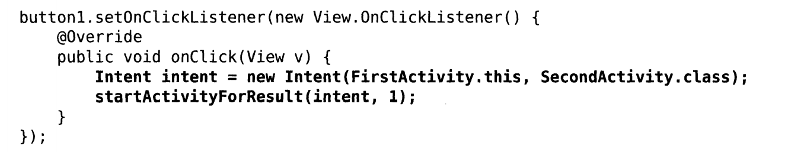

    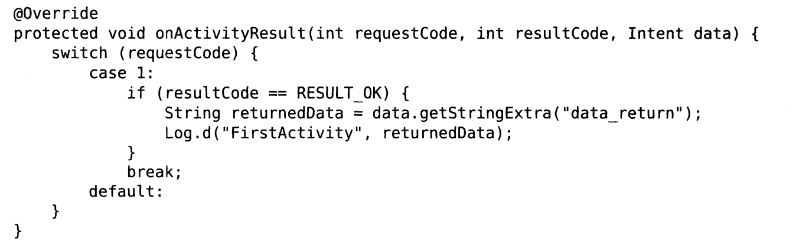

    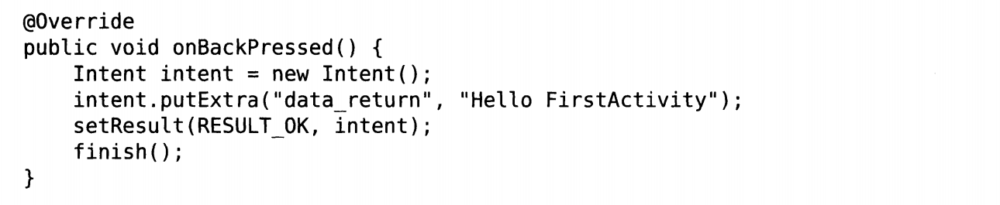

    目标活动中：

    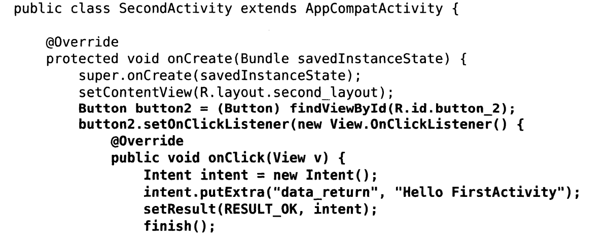

### 3. 活动的生命周期

生命周期图示:

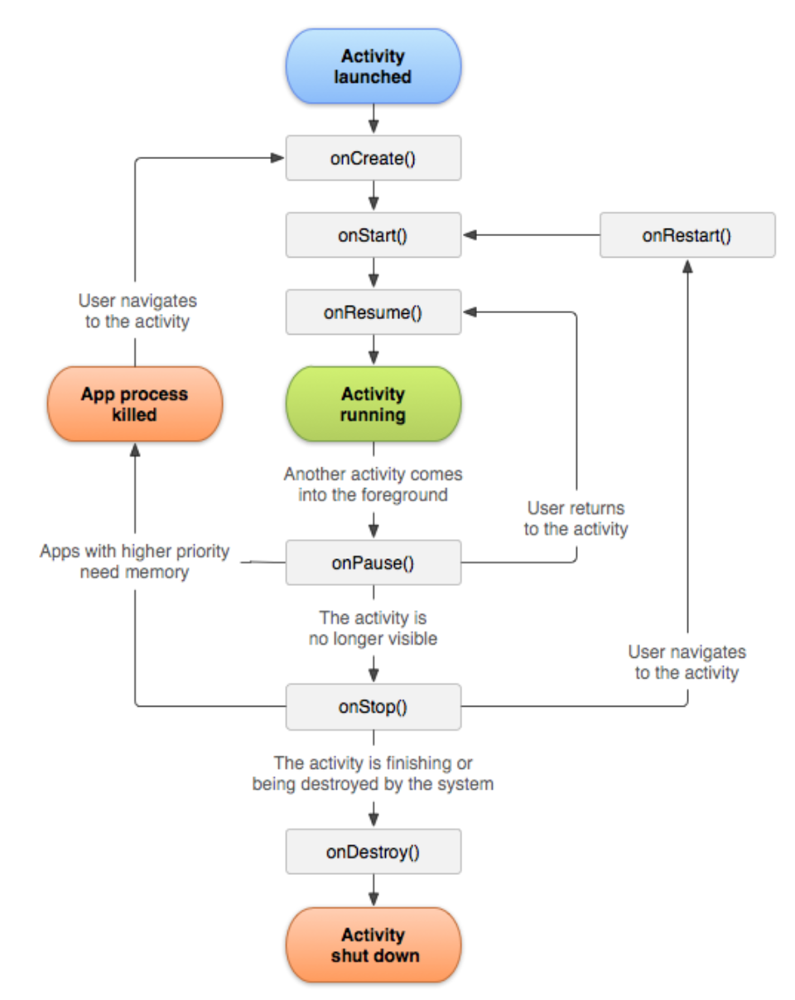

- `onCreate()-onDestroy()`：完整生存期。初始化-释放内存
- `onStart()-onStop()`：可见生存期。期间应当管理用户可见的资源
- `onResume()-onPause()`：前台生存期。例如Dialog会使其下层活动进入`onPause()`
- 使用Bundle的声明周期间数据保存方法：
  - Bundle类提供一系列方法用于保存数据
  - 回收前：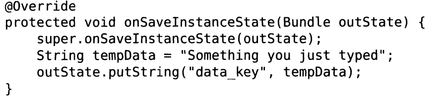
  - 回收后：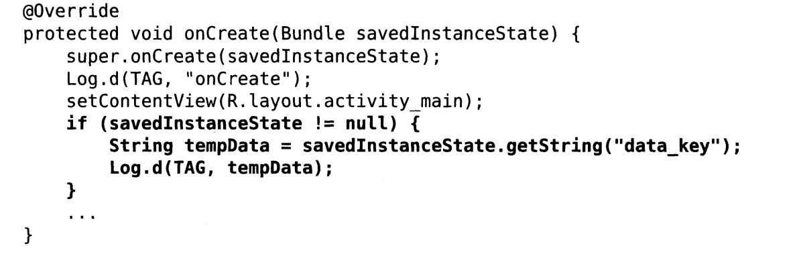
  - tips：可以用intent存储bundle对象进行数据传输。

### 4. 活动的启动模式：

通过修改配置文件中<activity\>项的`android:launchMode`改变活动启动模式

- standard：

  标准栈启动模式

  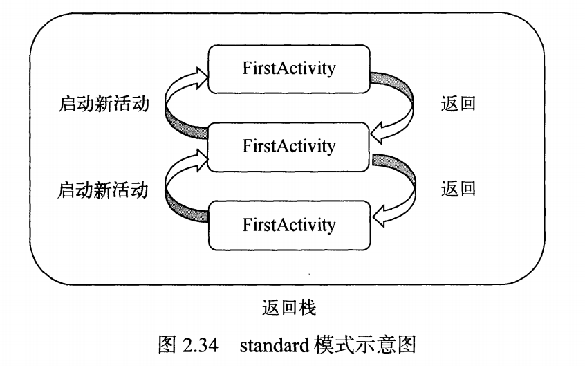

- singleTop：

  不会重复创建**栈顶活动**

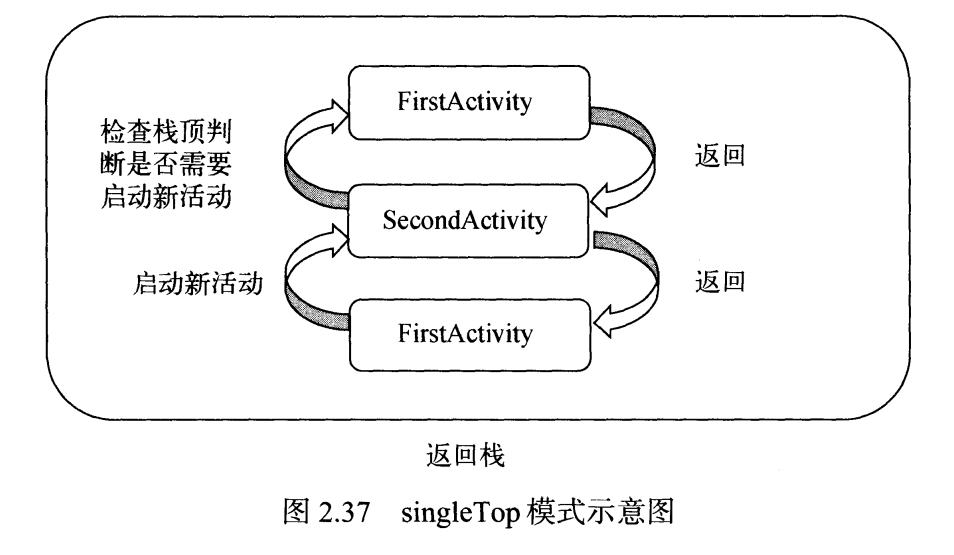

- singleTask：

  不会重复创建**已经创建过的活动**

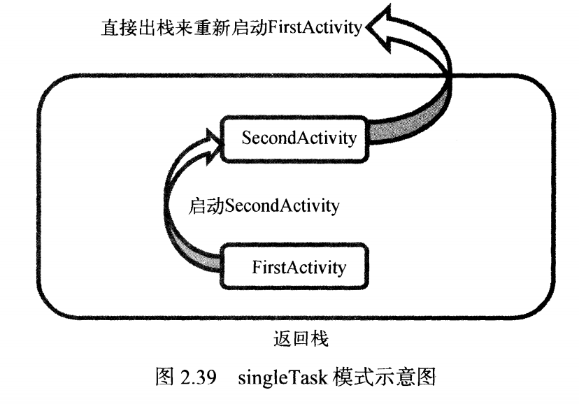

- singleInstance：

  每次启动该活动会**创建一个新的返回栈**来管理活动

  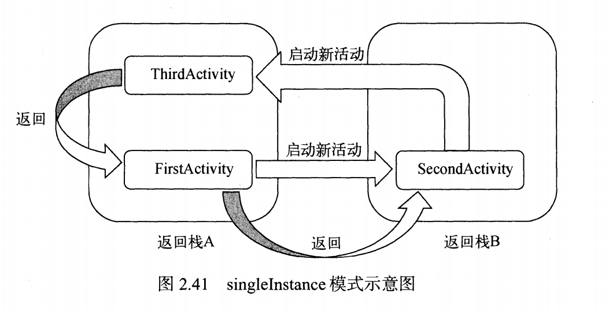

### 5. 活动最佳实践

- 使用BaseActivity继承AppComatActivity，定制BaseActivity的onCreate方法

  其他子活动继承BaseActivity，即可看到当前活动名。

  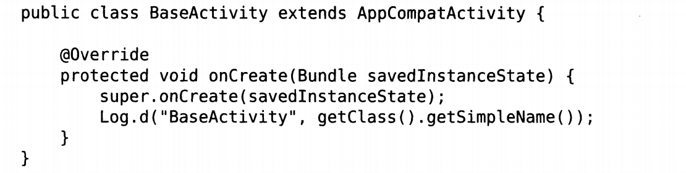

- 使用活动管理器进行活动管理：

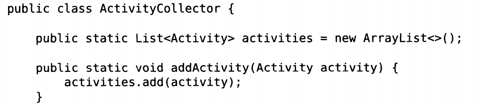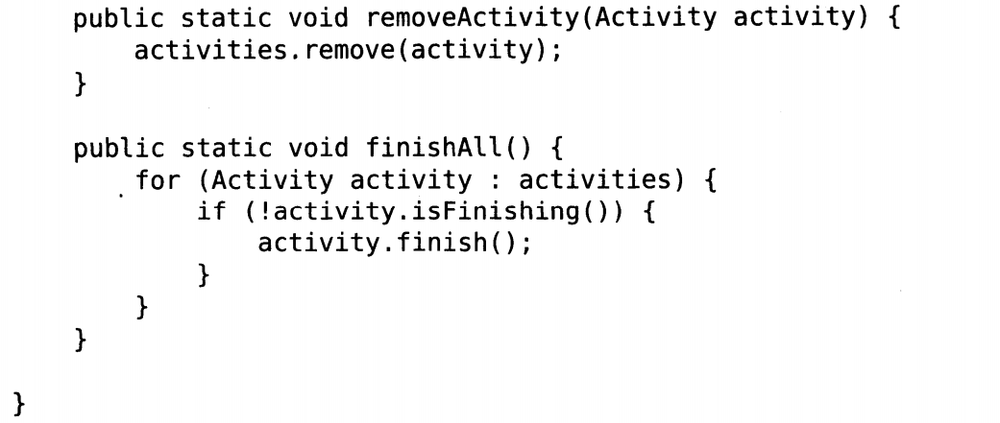

​	BaseActivity中：

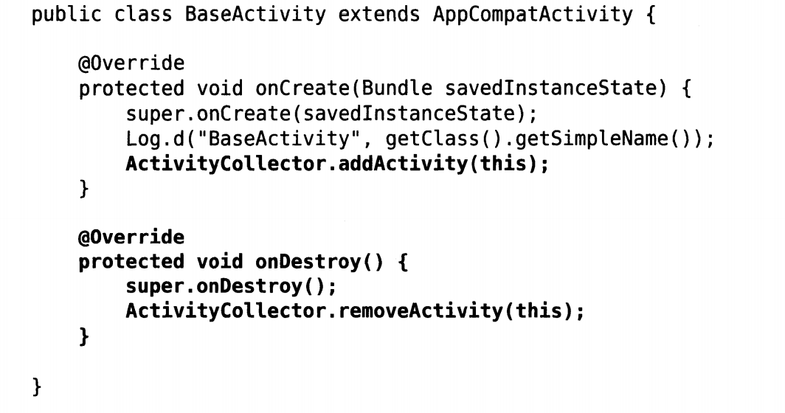

- 启用活动的最佳写法：

  避免别的开发者要给你的活动传递数据时不清楚需要putExtra中写什么内容

  在你的活动中添加：

  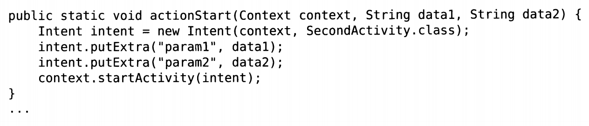

这样其他活动要穿越到你的活动时只需要：

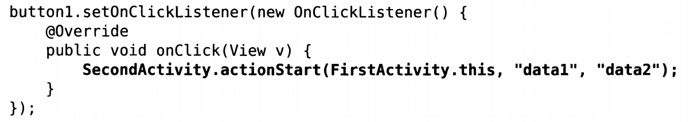

# 第三章

### 1. 常用控件的使用方法

- TextView

  `android:id`：每个控件都有的唯一标识符

  `android:layout_width/height`：控件宽度/高度，可选值有`match_parent`、`fill_parent`、`wrap_content`前两者：继承父组件布局，后者：内容决定控件大小。

  `android:text`：内容

  `android:gravity`：指定文字对齐方式，可选:`top/bottom/left/right/center/center_vertical/center_horizontal`；可用`|`同时指定多个值。

  `android:textSize`：文字大小，使用sp作为单位。dp、px区别：$px=dp\times (dpi/160)$ $dpi = \frac{\sqrt{height^2+width^2}}{size（对角线长度）}$；dp、sp区别：dp不适配文字，sp还可以适配文字，因此多采用sp作为大小单位。

  

- Button

  实现监听方式：

  1. 匿名类
  2. 继承接口

- EditText

  `android:hint`：提示字符

  `android:maxLines`：指定最大行数，超过就会slide

- ImageView

  `android:src=@drawable/xx`：指定要显示的图片,可以通过`setImageResource()`方法进行动态修改；

- ProgressBar

  `android:visibility`：可选值：`visible/invisible/gone`表示可见/不可见/不可见且不再占用空间；可以使用`setVisibility(View.VISIBLE/INVISIBLE/GONE)`方法进行设置；默认圆形进度条，可以设置`style="?android:attr/progressBarStyleHorizontal"`改为水平进度条，然后设置`android:max="100" `进度条最大值为100，通过方法`getProgress()/setProgress()`更改进度条的进度。

- AlertDialog

  弹出一个屏蔽掉其他控件的对话框，用于提示重要的内容或警告信息。

  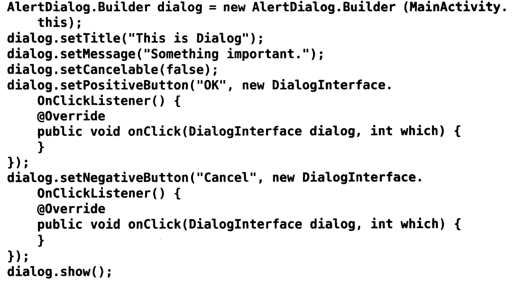

  类似的还有ProgressDialog，用于提示进度。不同的是如果在`setCancelable()`时传入False，则不能通过back键取消掉。此时必须要在恰当的时候调用`dismiss()`方法来关闭对话框。

### 2. 详解4种基本布局

​	布局是一种可用于放置很多控件的容器，它可以按照一定的规律调整内部控件的位置。

#### LinearLayout线性布局

- 所有控件在**线性方向**上垂直排列，可以通过`android:orientation="vertical/horizontal"`设置；

- 需要注意的是，如果设置为`horizontal`水平，就不能把子控件**宽度**设置为`match_parent`,否则单独一个控件将会把整个水平方向占满。

- `android:layout_gravity`用于指定布局的对齐方式，需要注意不能与线性方向冲突，否则会失效；可以用`|`连接；
- `android:layout_weight`使用在**线性方向上**用**比例方式**指定控件的大小，例如有两个button的weight都是1，则他们每个的宽度就是$ \frac{1}{2} $；若只指定部分控件的weight，则被指定的控件的"1"=总宽度-未指定weight控件的宽度。

#### RelativeLayout相对布局

- 可通过**相对定位**的方式让控件出现在布局的**任何位置**

- 各种属性：

  相对于父组件的：

  - `layout_alighParentLeft/Top/Right/Bottom/centerInParent`

  相对于兄弟组件的：

  - `layout_above/toLeftOf/below/toRightOf="@id/xx"`

#### FrameLayout帧布局

- 默认摆放在**左上角**
- 默认情况下多个组件会叠加在左上角
- 可以通过`layout_gravity`属性指定对齐方式

#### PercentFrameLayout百分比布局

- 不需要指定控件大小，直接按比例指定控件所占布局的百分比；
- 需要先导入依赖
- 继承了Frame的属性，默认左上角；因此还有**PercentRelativeLayout**可用。

### 3. 自定义控件

- 自定义布局（避免重复创建布局）：

  引用一个actionBar

  - 新建一个布局文件title.xml
  - 在其他xml文件中\<include layout="@layout/title"/>即可

- 自定义控件（避免重复创建监听响应代码）
  - 新建TitleLayout继承LinearLayout
  - `inflate()`加载动态布局文件`R.layout.title`
  - 注册onClick

### 4. ListView

