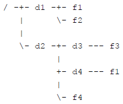

模拟题真就模拟题

<!--more-->

### [201512-3](http://118.190.20.162/view.page?gpid=T35)

#### 题目描述

本题要求编程实现一个用 ASCII 字符来画图的程序，支持以下两种操作：
　　Ÿ 画线：给出两个端点的坐标，画一条连接这两个端点的线段。简便起见题目保证要画的每条线段都是水平或者竖直的。水平线段用字符 - 来画，竖直线段用字符 | 来画。如果一条水平线段和一条竖直线段在某个位置相交，则相交位置用字符 + 代替。
　　Ÿ 填充：给出填充的起始位置坐标和需要填充的字符，从起始位置开始，用该字符填充相邻位置，直到遇到画布边缘或已经画好的线段。注意这里的相邻位置只需要考虑上下左右 4 个方向，

##### 输入

第1行有三个整数*m*, *n*和*q*。*m*和*n*分别表示画布的宽度和高度，以字符为单位。*q*表示画图操作的个数。
　　第2行至第*q* + 1行，每行是以下两种形式之一：
　　Ÿ 0 *x*1 *y*1 *x*2 *y*2：表示画线段的操作，(*x*1, *y*1)和(*x*2, *y*2)分别是线段的两端，满足要么*x*1 = *x*2 且*y*1 ≠ y2，要么 *y*1 = *y*2 且 *x*1 ≠ *x*2。
　　Ÿ 1 *x* *y* *c*：表示填充操作，(*x*, *y*)是起始位置，保证不会落在任何已有的线段上；*c* 为填充字符，是大小写字母。
　　画布的左下角是坐标为 (0, 0) 的位置，向右为*x*坐标增大的方向，向上为*y*坐标增大的方向。这*q*个操作按照数据给出的顺序依次执行。画布最初时所有位置都是字符 .（小数点）。

##### 输出

输出有*n*行，每行*m*个字符，表示依次执行这*q*个操作后得到的画图结果。

#### 问题分析

- 应该支持两个操作：画线段和填充。画线段直接循环即可，填充操作类似油漆桶，可用bfs或者dfs.
- 画线段时要注意"+"的条件：画“|”时，如果遇到“-”则画“+”，**否则**，如果不是“+”则画“|”。画“-”亦然。

#### 代码

```c++
int m,n,q;
char mp[300][300];
int zx[4] = {0,1,-1,0},
    zy[4] = {-1,0,0,1};
void draw(int x,int y,char c){
    if(mp[x][y] == '-' || mp[x][y] == '+' || mp[x][y] == '|'){
        return;
    }
    mp[x][y] = c;
    for(int i = 0;i<4;i++){
        int tx = x + zx[i];
        int ty = y + zy[i];
        if(tx >= 0 && ty >= 0 && tx < n && ty < m && mp[tx][ty] != c){
            draw(tx,ty,c);
        }
    }
}
int main(){
    cin>>m>>n>>q;
    for(int i = 0;i<n;i++){
        for(int j = 0;j<m;j++){
            mp[i][j] = '.';
        }
    }
    for(int i = 1;i<=q;i++){
        int op;
        cin>>op;
        switch(op){
            case 0:{
                int x1,x2,y1,y2;
                cin>>x1>>y1>>x2>>y2;
                if(x1 == x2){
                    if(y1>y2)swap(y1,y2);
                    for(int j = y1;j<=y2;j++){
                        if(mp[j][x1] == '-') mp[j][x1] = '+';
                        else if(mp[j][x1] != '+') mp[j][x1] = '|';
                    }
                }else {
                    if(x1>x2)swap(x1,x2);
                    for(int j = x1;j<=x2;j++){
                        if(mp[y1][j] == '|') mp[y1][j] = '+';
                        else if(mp[y1][j] != '+') mp[y1][j] = '-';
                    }
                }
                break;
            }
            case 1:{
                int x,y;
                char c;
                cin>>y>>x>>c;
                draw(x,y,c);
                break;
            }
        }
    }
    for(int i = n-1;i>=0;i--){
        for(int j = 0;j<m;j++){
            cout<<mp[i][j];
        }
        cout<<'\n';
    }
    return 0;
}
```

### [201604-3](http://118.190.20.162/view.page?gpid=T40)

#### 题目描述

为了指定文件系统中的某个文件，需要用**路径**来定位。在类 Unix 系统（Linux、Max OS X、FreeBSD等）中，路径由若干**部分**构成，每个部分是一个目录或者文件的名字，相邻两个部分之间用 / 符号分隔。
　　有一个特殊的目录被称为**根目录**，是整个文件系统形成的这棵树的根节点，用一个单独的 / 符号表示。在操作系统中，有**当前目录**的概念，表示用户目前正在工作的目录。根据出发点可以把路径分为两类：
　　Ÿ **绝对路径**：以 / 符号开头，表示从根目录开始构建的路径。
　　Ÿ **相对路径**：不以 / 符号开头，表示从当前目录开始构建的路径。

　　例如，有一个文件系统的结构如下图所示。在这个文件系统中，有根目录 / 和其他普通目录 d1、d2、d3、d4，以及文件 f1、f2、f3、f1、f4。其中，两个 f1 是同名文件，但在不同的目录下。

　　对于 d4 目录下的 f1 文件，可以用绝对路径 /d2/d4/f1 来指定。如果当前目录是 /d2/d3，这个文件也可以用相对路径 ../d4/f1 来指定，这里 .. 表示上一级目录（注意，根目录的上一级目录是它本身）。还有 . 表示本目录，例如 /d1/./f1 指定的就是 /d1/f1。注意，如果有多个连续的 / 出现，其效果等同于一个 /，例如 /d1///f1 指定的也是 /d1/f1。
　　本题会给出一些路径，要求对于每个路径，给出**正规化**以后的形式。一个路径经过正规化操作后，其指定的文件不变，但是会变成一个不包含 . 和 .. 的绝对路径，且不包含连续多个 / 符号。如果一个路径以 / 结尾，那么它代表的一定是一个目录，正规化操作要去掉结尾的 /。若这个路径代表根目录，则正规化操作的结果是 /。**若路径为空字符串**，则正规化操作的结果是当前目录。

##### 输入

第一行包含一个整数 *P*，表示需要进行正规化操作的路径个数。
第二行包含一个字符串，表示当前目录。
以下 *P* 行，每行包含一个字符串，表示需要进行正规化操作的路径。

```
7
/d2/d3
/d2/d4/f1
../d4/f1
/d1/./f1
/d1///f1
/d1/
///
/d1/../../d2
```

##### 输出

共 *P* 行，每行一个字符串，表示经过正规化操作后的路径，顺序与输入对应。

```
/d2/d4/f1
/d2/d4/f1
/d1/f1
/d1/f1
/d1
/
/d2
```

#### 问题分析

- 直接`split('/')`就好了啊！让俺瞅瞅cpp的split方法怎么写！Google启动！
- 靠c++没有split
- 那俺自己实现一个，把分割好的扔到`vector<string>`不就行了
- 依照题意，遍历一遍处理好的vector，把有内容的都压到新的`vector<string>`里，忽略内容为空的、内容为`.`的；遇到`..`的就把新vector`pop_back()`一下，注意不要空弹。
- 注意有**空字符串**，因此读入要用getline，不然读不到。

#### 代码

```c++
std::vector<std::string> split(const std::string &s, char delim) {
    std::vector<std::string> elems;
    std::stringstream ss(s);
    std::string item;
    while (std::getline(ss, item, delim)) {
        elems.push_back(item);
    }
    return elems;
}
inline void process(std::string s){
    std::vector<std::string> st = split(s,'/');
    std::vector<std::string> ans;
    for(auto it = begin(st);it!=end(st);it++){
        if((*it) == "." || (*it) == "") continue;
        if((*it) == ".."){
            if(!ans.empty()) ans.pop_back();
        }else {
            ans.push_back((*it));
        }
    }
    if(ans.empty()) std::cout<<"/";
    for(auto it = ans.begin();it!=ans.end();it++){
        std::cout<<"/"<<(*it);
    }
    std::cout<<"\n";
    return;
}
int main(){
    int n;
    std::string location;
    std::cin>>n>>location;
    std::cin.get();
    for(int i = 1;i<=n;i++){
        std::string s;
        getline(std::cin,s);
        if(s[0] == '/'){
            process(s);
        }else{
            s = location + "/" + s;
            process(s);
        }
    }
    return 0;
}
```

