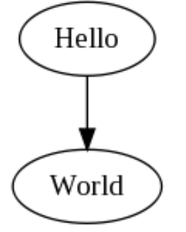
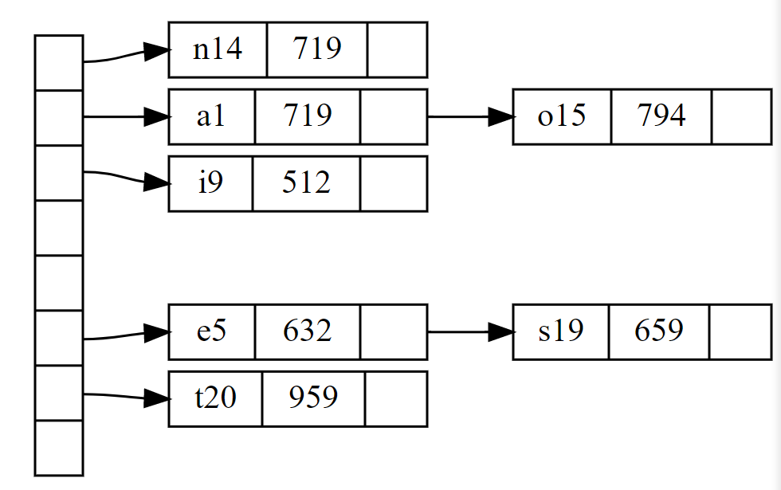
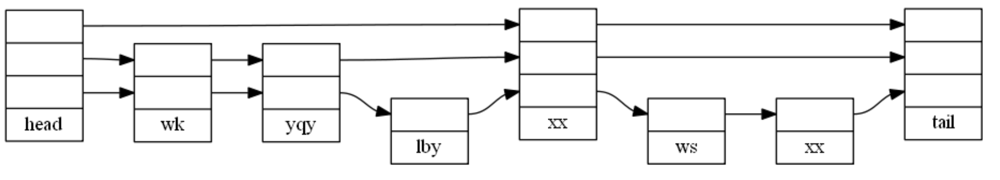
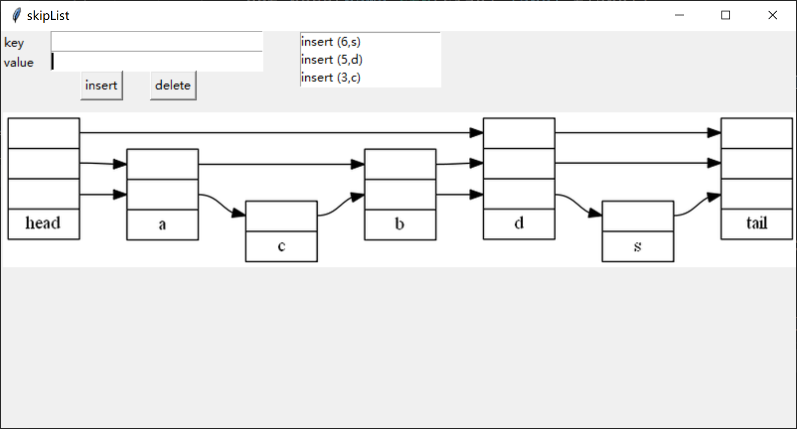

## Step0: 分析需求

由于要求使用C++编写核心代码 /挠头，而我又不咋会用QT，看了一下QT的教程感觉也代码量++，所以就没选QT写图形界面。但是如果用D3.js的话又会有一堆c++源码与js通信之类的问题。直到我发现了swig——

<!--more-->

## Step1：在Python中使用C++：用Swig封装C++源码

#### Swig简介

Swig（*Simplified Wrapper and Interface Generator*）安装与使用非常（相对来说）方便：

- SWIG (Simplified Wrapper and Interface Generator)  简单的包装和接口生成器

- SWIG 可以 **把C++代码封装成Python库**

- SWIG 实际上是一个**编译器**，获取C/C++的声明，用一个壳包起来，以便通过其他语言访问这些声明。

[下载](http://www.swig.org/)

[文档](http://www.swig.org/Doc1.3/SWIGPlus.html#SWIGPlus)

下载解压加Path一气呵成

#### 具体流程：

##### 1. 编写C/C++文件

推荐.h文件声明+.c/.cpp文件实现，这样后边写接口文件会方便一些。

例如：

```c++
// skipList.h
#include<iostream>
#include<cstring>
#include<string>
#include<cmath>
#include<vector>
using namespace std;
struct skipNode{
    pair<int,string> element;
    skipNode** next;
    int level;
    skipNode();
    skipNode(pair<int,string> element,int nextSize);
};
class SkipList{
    private:
    skipNode* headNode,*tailNode;
    int tailKey ;
    skipNode** last;
    int cutoff,maxLevel;
    int maxKey;
    skipNode* search(int key);
    public:
    int dSize;int levels;
    SkipList(int largeKey,int maxPairs, double prob);
    int makeLevel() const;
    void insert(const pair<int,string> element);
    skipNode find(int key);
    void erase(int key);
    void eraseMin();
    void eraseMax();
    vector<skipNode> getKeyList();
};
```

实现文件*skipList.cpp*太长就不贴了

##### 2. 编写.i 接口文件

swig需要使用.i接口文件进行对接

```
// skipList.i
%module skipList
%include "std_pair.i"
%include "std_string.i"
%include "std_vector.i"
%{
#include "skipList.h"
%}
%include"skipList.h"
%template(make_pair) pair<int,string>;
%template(vec) vector<skipNode>;
```

这个文件的编写规范在[Swig-C++文档](http://www.swig.org/Doc1.3/SWIGPlus.html#SWIGPlus)里可以查到。

- 这里因为使用了pair/string/vectorSTL的内容所以需要前面include三个预置的.i文件
- `%module`后面的名字是**被封装的模块名称**，Python通过这个名称加载程序。

- `%{...%}`之间是**函数声明和头文件。**

- 最后一部分，**声明了要封装的函数和变量**，一般来说直接include .h文件就可。
- 但是这里我增加了`pair<int,string>` 和 `vector<skipNode>`两个特化模板类，因为后续Python中需要调用这两个东西(`pair`用于插入、`vector`用于遍历跳表)
- 这里可以注意到接口文档中所有的模板类都需要特化之后才能编进包内。思考一下原因应该就是：swig没法支持在Python中再进行模板的实例化，因此需要提前指定好模板类型。

##### 3. 调用Swig产生python模块

确认添加完**环境变量**，把.i .c .cpp 文件放在同一个目录下后，可以直接在该目录的powerShell下输入如下指令

```shell
Swig -c++ -python skipList.i
```

当然如果是c文件就不用加 `-c++ `选项了

如果没有报错的话，你会发现同级目录下多出了三个文件

- _skipList.cp37-win_amd64.pyd
- skipList.py
- skipList_warp.cxx

这个skipList.py就是我们要用的库，但是现在里边应该没什么东西。

然后进入下一步：

##### 4. 利用distutils生成动态库

新建一个`setup.py`

```python
from distutils.core import setup, Extension

skipList_module = Extension('_skipList',
                           sources=['skipList_wrap.cxx', 'skipList.cpp'],
                           )

setup(name='skipList',
      version='0.1',
      author="SWIG Docs",
      description="""skipList package""",
      ext_modules=[skipList_module],
      py_modules=["skipList"],
      )
```

然后编译生成

```python
python setup.py build_ext --inplace
```

对了，顺带提一句，我的python版本是3.7

然后如果你跟我一样电脑从来没有装过VS的任何版本的话，你将会收到报错：

```
error: Unable to find vcvarsall.bat
```

原因具体见：[在安装Python包的时候报错：error: Unable to find vcvarsall.bat的解决办法](https://blog.csdn.net/u013044310/article/details/96285422)

大概意思就是缺少把c++编译成python包的文件，这个文件swig没有，必须到VS家下，当然也可以不装VS只装个工具集就ok。

python3.5+的版本 [Visual C++ Build Tools 2015](http://go.microsoft.com/fwlink/?LinkId=691126)

其他版本到上边那个文章里面找就可以了。

装完之后重新输入上边的指令。看到

```shell
Finished generating code
```

就说明你的c++包已经成功编成python扩展包了

你可以试用一下：

```python
from skipList import SkipList,pairis,skipNode,vec
skp = SkipList(1000,1000,0.5)
skp.insert(make_pair(1,"this is a value"))
node = skp.getKeyList()
for node in nodes :
    print(node.element.first+","+node.element.second)
```

这样应该能得到输出

```
1,this is a value
```

如果你尝试直接输出一下node，你将会得到：

```
<skipList.skipNode; proxy of <Swig Object of type 'skipNode *' at 0x0000022302E84540> >
```

因为node在c++中`vector<skipNode>`类型的变量，因此swig对其进行了封装，不能直接输出，但是依然可以通过成员/方法调用。

以上是c++核心代码封装成python包的过程。

#### 参考:

[这篇博客](https://www.jianshu.com/p/ccd239bd11d9)


所以又回到了开始的问题：**我为啥不用QT？**

## Step2：图怎么画？利用Graphviz Dot画跳表

#### Graphviz介绍

图形可视化是一种将结构信息表示为抽象图形和网络图的方式。Graphviz是大名鼎鼎的贝尔实验室的几位牛人开发的一个画图工具。可以通过dot文件提供的结构信息直接生成对应的图形。

#### 使用Graphviz绘制图形

Graphviz使用的dot文件十分简单易懂：一个图应该只包含点、边。那么一个最简单的图应该就是这样：



它的源码是这样：

```
digraph G{
	hello->world;
}
```

当然可以通过给点和边赋予不同的属性值，调整颜色、标签、内容、样式等等。

比如，一个复杂一点的哈希表：



```
digraph g {
    nodesep = .05;
    rankdir = LR; //规定了图的方向->左到右

    node[shape = record,  width = .1,  height = .1];
	// 节点的形状是“record”（方形）
    node0[label = "<f0> |<f1> |<f2> |<f3> |<f4> |<f5> |<f6> |",  height = 2.5];
    //我是一个节点, 我有8个格，前7个可以被引用
    node [width = 1.5];
    node1[label = "{<n> n14 | 719 |<p>}"];
    //我还是一个节点, 有横向的三个格子，前后的格子都可以被引用
    node2[label = "{<n> a1 | 719 |<p>}"];
    node3[label = "{<n> i9 | 512 |<p>}"];
    node4[label = "{<n> e5 | 632 |<p>}"];
    node5[label = "{<n> t20 | 959 |<p>}"];
    node6[label = "{<n> o15 | 794 |<p>}"];
    node7[label = "{<n> s19 | 659 |<p>}"];

    //好了, 我开始连接了
    node0:f0->node1:n; // node0的f0位置连到node1的n位置
    node0:f1->node2:n;
    node0:f2->node3:n;
    node0:f5->node4:n;
    node0:f6->node5:n;
    node2:p->node6:n;
    node4:p->node7:n;
}
```

#### 使用Graphviz绘制跳表

基（yao）本（yong）的语法大概看懂了，够用了。那么如何用Graphviz绘制成跳表呢？

根据规律每次生成一份dot文件倒是也行，不过源码里估计也是一堆string不能看了。

灵机一动，反正也是用python搞，万一有现成的包什么的呢？

然后就找到了这个：[python-graphviz API文档](https://graphviz.readthedocs.io/en/stable/api.html#other) (不愧是本世纪第一脚本语言哈哈哈哈生态果然好)

就开始画呗。稍微理顺一下跳表的画图思路：

1. 首先得把图的所有节点以及每个节点的指针层数整出来
2. 每层的前一个节点连到后一个节点的对应位置
3. 每个节点的命名应该是独立的，所以直接用节点key值是最合适的
4. 头尾节点指针层数取所有节点的Max

按照上述思路，写了一份还算简短的绘图代码：

```python
    def reDraw(self):
        # 实例化一个Digraph对象(有向图)，name:生成的图片的图片名，format:生成的图片格式
        dot = Digraph(name="pic", comment="skipList", format="png",graph_attr={("rankdir","LR")},node_attr={("shape","record")}) 
        hlabel = "head"
        tlabel = "tail"
        last = [] # 用这个记录每层最后一个节点的名字（key）
        for i in range(0,self.skipList.levels+1):
            hlabel =  "<l" + str(i) + ">|" + hlabel # 应该是一层层倒着摞上去
            tlabel =  "<l" + str(i) + ">|" + tlabel
            last.append(-1)
        size = 2147483647
        dot.node(name="-1",label=hlabel)
        dot.node(name=str(size),label=tlabel)
        nodes = self.skipList.getKeyList() # 得到所有节点的接口
        for node in nodes:
            label = str(node.element.second)
            i = node.element.first # 节点key值
            for j in range(0,node.level+1):
                label =  "<l" + str(j) + ">|" + label
            dot.node(name=str(i),label=label)
            for j in range(0,node.level+1):
                dot.edge(str(last[j])+":l"+str(j),str(i)+":l"+str(j))
                last[j] = i
        for i in range(0,self.skipList.levels+1):
            dot.edge(str(last[i])+":l"+str(i),str(size)+":l"+str(i))
        dot.render(filename='pic',view=False)
```

最后我们直接可以用`dot.render()`方法生成图片，从而跳过输出源码再编译生图这一步转化。

效果图：



Graphviz不止于此，有兴趣的同学可以去Graphviz官网康康其他图的demo。

#### 参考：

[利用Graphviz Dot绘图](http://blog.songzhigang.com/others/graphviz-dot.html)

[Graphviz-Graph Visualization Software](https://graphviz.gitlab.io/about/)

## Step3：挑一个GUI库吧！Tkinter 的使用

既然前面两个都用到python了，那么我们继续用python做GUI咯

#### 需求分析


这是课设里的基本要求，当然也就是我们的需求：

- 输入框，用于输入需要插入/删除/查找的key和value，当然前面应该有提示信息

- 几个button，与插入删除查找函数绑定
- 显示框，每次操作后调用新生成跳表的图片
- 显示框，显示历史，记录操作后显示进行的操作以及运行时间等信息

#### 用Tkinter实现需求

（python的GUI接口果然简单Max分分钟构建GUI）

注：图片显示使用的文件需要写到类成员中，不然每次生成图片之后局部变量自动清空图片也就没了。

#### 参考：

[tkinter教程](https://morvanzhou.github.io/tutorials/python-basic/tkinter/)

[python打开网络图片并缩放](https://blog.csdn.net/yangdashi888/article/details/73321919)

## Step4：组合！

那么我们动态展示的思路就差不多了：

1. 编写C++核心源码，用swig生成python包并调用
2. 在py文件中实例化一个skipList类
3. 通过GUI与用户交互从而获得数据，利用数据进行skipList的一系列操作
4. 对于每次交互得到一个skipList的状态，利用其重新构建dot文件并生成图片并显示



完成！Python真香！