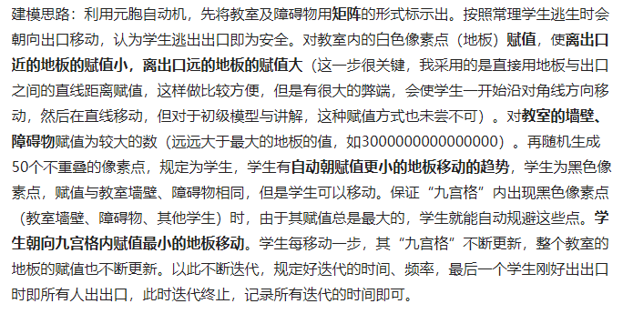

### 元胞自动机（Cellular Automaton）

#### 概念

看上去很厉害，其实就是一种仿真模型，根据一定的规则，通过上一时刻状态对空间内（通常是二维）的数组变量进行下一状态的推算。

<!--more--->

拿一维CA举例：

假设初始状态是（如图）：010010000（每个格子的01随机取定/根据初始化约束确定）

那么从上面初始状态进行一代代迭代就可以得到（黑色表示1，白色表示0）：

不妨将其称为CA三要素：

- 初始状态
- 转移规则
- 结束状态

建模中常用的是二维/三维上的CA，用于模拟一些系统（森林火灾、封闭空间逃生、疾病传播、城镇扩张、洪水演进等）。

btw，对于某个元胞，有两种邻居称呼方式：

- VonNeumann邻居，即只考虑前后左右的邻居。
- Moore邻居，即考虑周边相邻的所有邻居。

#### 有什么用

CA通常可以应用于研究**系统问题**，which由若干不同的对象组成，对象之间可以相互作用，因此适用于一些**机理建模**的问题中。从上面的简述也可以看出，起**决定作用**的是**转移规则**的定义。根据具体问题的不同可以自行定义**适合题目要求**的规则，并设置一定的迭代次数，在根据题目要求或者直接随机初始化元胞，之后按照迭代次数和转移规则仿真模拟系统在不同时刻（或其他物理量）的变化状况与趋势，最后综合评估系统状况以及转移规则是否合适。

#### 具体应用

##### 人员疏散模型：

具体参考：

[张鑫龙, 陈秀万, 李怀瑜, 李飞. 一种改进元胞自动机的人员疏散模型. 武汉大学学报·信息科学版, 2017, 42(9): 1330-1336.](http://html.rhhz.net/WHDXXBXXKXB/html/20170921.htm#zz)

该模型将社会力模型应用于人员疏散的CA中，社会力模型可表示为：

根据每个元胞受力不同，计算该元胞下一时刻的速度方向及大小变化，从而推算出所有元胞的下一时刻所在位置及状态（速度方向、大小、加速度方向、大小）。

为了将行人（元胞）之间的碰撞情况也纳入考量，该模型将默认元胞自动机“每个元胞占据一个单元格的设定”改为“每个元胞占据四个单元格”，以能够模拟出行人的拥挤状况。

##### 教室逃生模型：

##### 森林火灾模型

假如某棵树着火了，那么在cell里的数值，就应当是1，代表这棵树着火了，并且在下一个时刻，这个cell的数值将变成0，代表树烧没了。在森林火灾模型中，规则就是：**只要4个邻居cells有一个是1，并且自己是2，那么下个时间节点自己将变成1，再下一个时间节点自己变成0。**

有点类似于最著名的生命游戏的规则：

#### 总结

可以看到，大多数时候CA只是一种概念，如何在具体问题中去应用CA进行系统分析，才是建模过程中需要认真考虑的问题。

一些想法：

- 既然多数CA用二维数组实现，是不是可以考虑使用卷积简化运算？
- 除了最常用的matlab实现，是否可以考虑使用D3.js等可视化工具让生成的CA更好看？