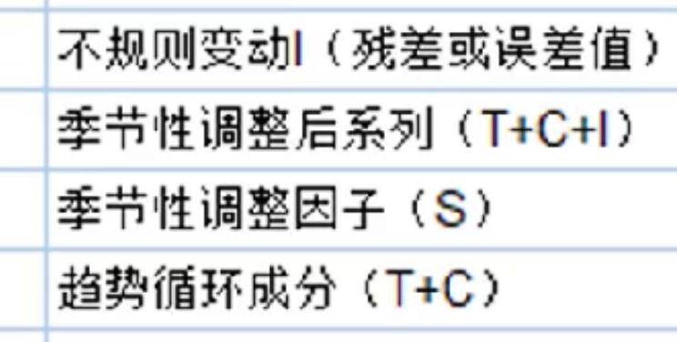
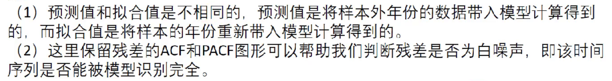
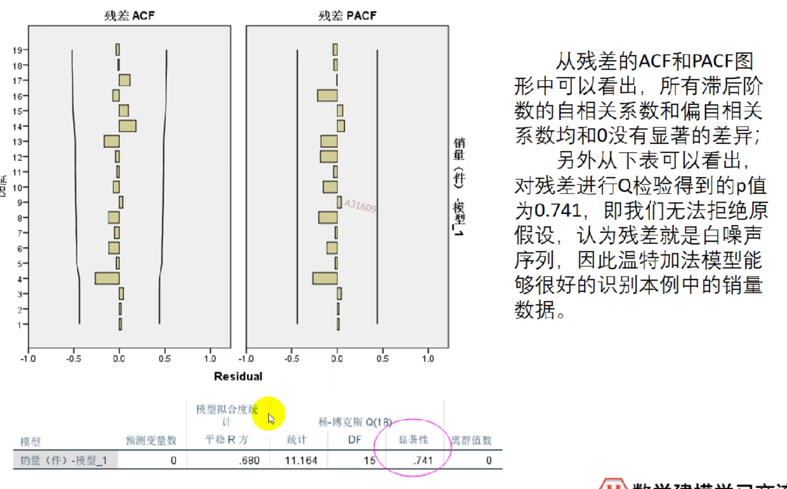
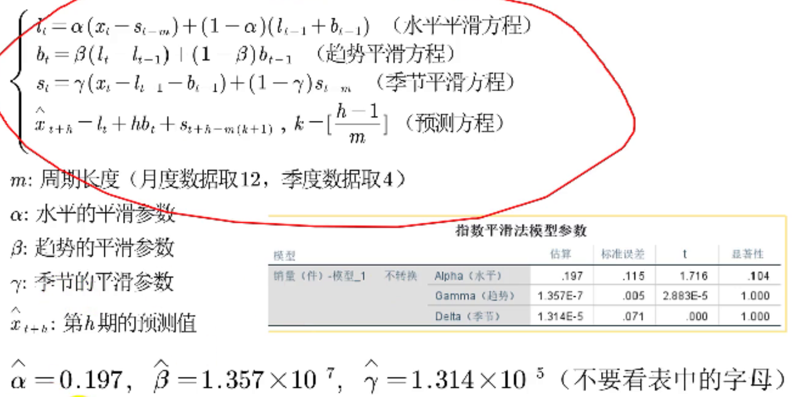
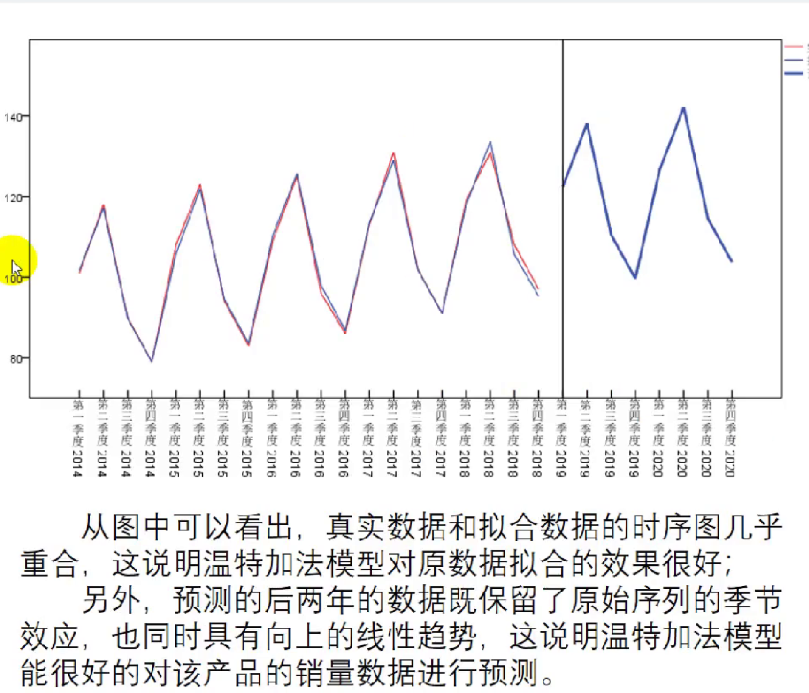

## 时间序列分析

时间序列是某个数值长期变化的数字表现。

两个要素：时间要素、数值要素。

<!--more-->

- 时期序列可加（例如中国每年的GDP总值）
- 时点序列不可加（例如某地每隔一小时测得的温度）

### 时间序列分解

长期趋势是指在**相当长的一段时间内**统计指标持续上升或者下降的趋势。T

季节趋势是指由于**季节的转变**使得指标数值发生**周期性**变动。S（百度指数）

循环变动通常**以若干年为周期**，再曲线图上表现为波浪式的周期变动。C

不规则变动（白噪声）I

四种变动关系：相加/相乘

- 四种变动相互独立：相加$Y=T+S+C+I$
- 四种变动相互影响：乘积$Y=T\times S\times C\times I$

根据时间序列图，波动越来愈大建议乘积，否则如果保持恒定建议叠加。

### SPSS

#### 时间序列缺失值处理

开头结尾——直接删掉

中间位置——替换缺失值（五种方法）

#### 定义时间变量

数据-定义日期与时间-（具体）

#### 时序图

分析-时间序列预测-序列图-选择时间轴标签

#### 时间序列分解

分析-时间序列预测-季节性分解-加/乘-移动平均值（周期奇数/偶数）

#### 分解后变量

#### 分解后的时序图

加上分解后变量重新绘图

### 时间序列分析

具体步骤：

- 做出序列图
- 判断变动成分
- 序列分解（周期<1年）
- 建立时间序列分析模型
- 预测未来指标数值

