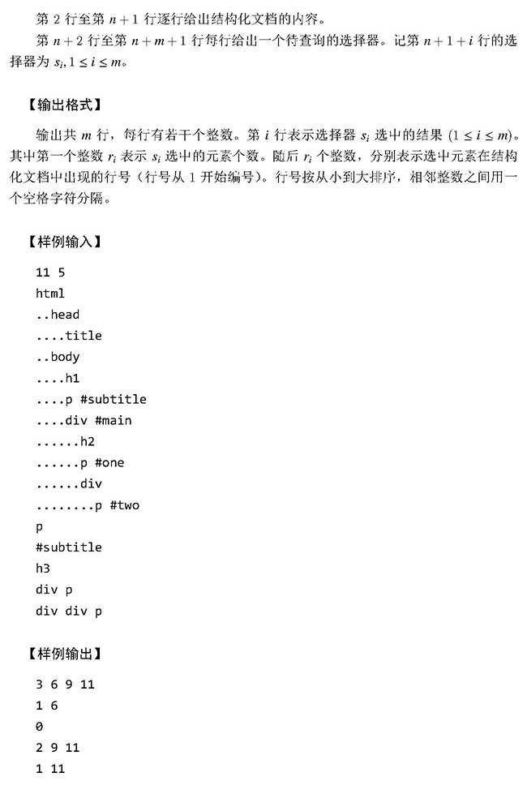

### 炉石传说

最后俩模拟！！

<!--more-->

#### 题目描述

* 玩家会控制一些**角色**，每个角色有自己的**生命值**和**攻击力**。当生命值小于等于 0 时，该角色**死亡**。角色分为**英雄**和**随从**。

　　* 玩家各控制一个英雄，游戏开始时，英雄的生命值为 30，攻击力为 0。当英雄死亡时，游戏结束，英雄未死亡的一方获胜。
　　* 玩家可在游戏过程中召唤随从。棋盘上每方都有 7 个可用于放置随从的空位，从左到右一字排开，被称为**战场**。当随从死亡时，它将被从战场上移除。
　　* 游戏开始后，两位玩家轮流进行操作，每个玩家的连续一组操作称为一个**回合**。
　　* 每个回合中，当前玩家可进行零个或者多个以下操作：
　　1) **召唤随从**：玩家召唤一个随从进入战场，随从具有指定的生命值和攻击力。
　　2) **随从攻击**：玩家控制自己的某个随从攻击对手的英雄或者某个随从。
　　3) **结束回合**：玩家声明自己的当前回合结束，游戏将进入对手的回合。该操作一定是一个回合的最后一个操作。
　　* 当随从攻击时，攻击方和被攻击方会同时对彼此造成等同于自己攻击力的**伤害**。受到伤害的角色的生命值将会减少，数值等同于受到的伤害。例如，随从 *X* 的生命值为 *HX*、攻击力为 *AX*，随从 *Y* 的生命值为 *HY*、攻击力为 *AY*，如果随从 *X* 攻击随从 *Y*，则攻击发生后随从 *X* 的生命值变为 *HX* - *AY*，随从 *Y* 的生命值变为 *HY* - *AX*。攻击发生后，角色的生命值可以为负数。
　　本题将给出一个游戏的过程，要求编写程序模拟该游戏过程并输出最后的局面。

##### 输入

　输入第一行是一个整数 *n*，表示操作的个数。接下来 *n* 行，每行描述一个操作，格式如下：
　　<action> <arg1> <arg2> ...
　　其中<action>表示操作类型，是一个字符串，共有 3 种：summon表示召唤随从，attack表示随从攻击，end表示结束回合。这 3 种操作的具体格式如下：

　　* summon <position> <attack> <health>：当前玩家在位置<position>召唤一个生命值为<health>、攻击力为<attack>的随从。其中<position>是一个 1 到 7 的整数，表示召唤的随从出现在战场上的位置，原来该位置及右边的随从都将顺次向右移动一位。
　　* attack <attacker> <defender>：当前玩家的角色<attacker>攻击对方的角色 <defender>。<attacker>是 1 到 7 的整数，表示发起攻击的本方随从编号，<defender>是 0 到 7 的整数，表示被攻击的对方角色，0 表示攻击对方英雄，1 到 7 表示攻击对方随从的编号。
　　* end：当前玩家结束本回合。
　　注意：随从的编号会随着游戏的进程发生变化，当召唤一个随从时，玩家指定召唤该随从放入战场的位置，此时，原来该位置及右边的所有随从编号都会增加 1。而当一个随从死亡时，它右边的所有随从编号都会减少 1。任意时刻，战场上的随从总是从1开始连续编号。

##### 输出

　输出共 5 行。
　　第 1 行包含一个整数，表示这 *n* 次操作后（以下称为 *T* 时刻）游戏的胜负结果，1 表示先手玩家获胜，-1 表示后手玩家获胜，0 表示游戏尚未结束，还没有人获胜。
　　第 2 行包含一个整数，表示 *T* 时刻先手玩家的英雄的生命值。
　　第 3 行包含若干个整数，第一个整数 *p* 表示 *T* 时刻先手玩家在战场上存活的随从个数，之后 *p* 个整数，分别表示这些随从在 *T* 时刻的生命值（按照从左往右的顺序）。
　　第 4 行和第 5 行与第 2 行和第 3 行类似，只是将玩家从先手玩家换为后手玩家。

#### 题目分析

- 用vector模拟插入删除操作
- 注意插入随从时原有位置的右边会统一右移，有随从死亡时会该随从右边的随从全部左移。

#### 代码

```c++
#include<bits/stdc++.h>
using namespace std;

struct Warrior {
    int health;
    int attack;
    Warrior(int h, int a) : health(h), attack(a) {}
};

vector<Warrior> player[2];

int main() {
    int N;
    cin >> N;
    int pid = 0;
    player[0].push_back(Warrior(30, 0));
    player[1].push_back(Warrior(30, 0));
    for(int n=0; n<N; n++) {
        string type;
        cin >> type;
        if(type == "summon") {
            int pos, h, a;
            cin >> pos >> a >> h;
            player[pid].insert(player[pid].begin()+pos, Warrior(h, a));
        }
        else if(type == "attack") {
            int att, deff;
            cin >> att >> deff;
            player[pid][att].health -= player[!pid][deff].attack;
            player[!pid][deff].health -= player[pid][att].attack;
            if(player[pid][att].health <= 0 && att!=0) {
                player[pid].erase(player[pid].begin()+att);
            }
            if(player[!pid][deff].health <= 0 && deff!=0) {
                player[!pid].erase(player[!pid].begin()+deff);
            }
        }
        else if(type == "end") {
            pid = !pid;
        }
    }
    if(player[0][0].health>0 && player[1][0].health>0) cout << 0 << endl;
    else if(player[0][0].health>0) cout << 1 << endl;
    else cout << -1 << endl;
    for(int i=0; i<2; i++) {
        cout << player[i][0].health << endl;
        cout << player[i].size()-1 << " ";
        for(int j=1; j<player[i].size(); j++) {
            cout << player[i][j].health << " ";
        }
        cout << endl;
    }
}
```


### 元素选择器



#### 题目描述


#### 题目分析

- 注意亿点点细节：
  - **标签**大小写**不**敏感 **id属性**大小写敏感
  - 空格数不固定 需要split手动通过空格分割选择器
  - 倒着查询比较效率高

#### 代码

```c++
#include<bits/stdc++.h>
using namespace std;

struct tree
{
    int id, dots;
    string tag, name;
    tree* parent;

    tree(int id, int dots, string tag, string name): id(id), dots(dots), tag(tag), name(name) ,parent(0) {}
};

void split(const string &str, vector<string> &out)
{
    string last;
    last.clear();
    for (int i = 0; i < str.size(); i++)
    {
        if(str[i] == ' ')
        {
            out.push_back(last);
            last.clear();
        }
        else last+=str[i];
    }
    out.push_back(last);
}

bool enval(const string &a,const string &b)
{
    if(a.size() != b.size()) return 0;
    for(int i = 0; i < a.size(); i++)
    {
        if(tolower(a[i]) != tolower(b[i])) return 0;
    }
    return 1;
}

bool apply(string str, tree *t)
{
    if(str[0] == '#') return str == t->name;
    else return enval(str, t->tag);
}

int main()
{
    int n,m;
    string line;
    scanf("%d%d",&n,&m);

    getline(cin,line);

    vector<tree *> nodes;
    stack<tree *> sta;

    for(int i = 1; i <= n; i++)
    {
        getline(cin, line);

        int dots=0;
        while (line[dots] == '.') dots++;

        string tag, name;
        stringstream ss(line.substr(dots));
        ss >> tag >> name;

        tree *now = new tree(i, dots, tag, name);
        if(!sta.empty())
        {
            tree* top;
            while (top = sta.top(), top->dots >= dots)
                sta.pop();
            now->parent = top;
        }
        sta.push(now);
        nodes.push_back(now);
    }
    vector<string> selector;
    vector<int> ans;
    ans.clear();
    while (m--)
    {
        getline(cin, line);
        selector.clear();
        split(line, selector);
        ans.clear();
        for (int i = 0; i < nodes.size(); i++)
        {
            if (apply(selector.back(),nodes[i]))
            {
                tree *t = nodes[i];
                int sl = selector.size()-1;
                while(t && sl>=0)
                {
                    if(apply(selector[sl],t)) sl--;
                    t = t->parent;

                }
                if (sl == -1)
                    ans.push_back(nodes[i]->id);
            }
        }
        printf("%d ",ans.size());
        for (int i = 0; i < ans.size() ; i++)
            printf("%d ",ans[i]);
        printf("\n");
    }

    return 0;
}
```

