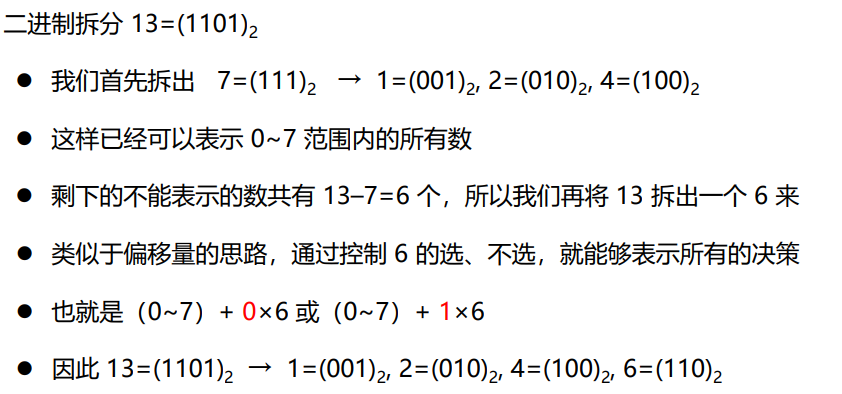

题目突然变多且难度下降？

<!--- more-->

1-4过于简单，就偷个懒了

### A

while循环判断到20break即可

### B

旋转=角对称+水平对称

### C

`cout<<char(((c-'A')+21)%26+'A')`

### D

记相邻两个序列全2/1长度为n/m，合法序列长度就是min（n，m）,然后取个max就是答案

### E

#### 题目描述

一家银行计划安装一台用于提取现金的机器。
机器能够按要求的现金量发送适当的账单。
机器使用正好N种不同的面额钞票，例如D_k，k = 1,2,…,N，并且对于每种面额D_k，机器都有n_k张钞票。
例如，
$$N = 3，
n_1 = 10，D_1 = 100，
n_2 = 4，D_2 = 50，
n_3 = 5，D_3 = 10$$
表示机器有10张面额为100的钞票、4张面额为50的钞票、5张面额为10的钞票。
东东在写一个 ATM 的程序，可根据具体金额请求机器交付现金。
注意，这个程序计算程序得出的最大现金少于或等于可以根据设备的可用票据供应有效交付的现金。

##### 输入

```
程序输入来自标准输入。 输入中的每个数据集代表特定交易，其格式为：Cash N n1 D1 n2 D2 ... nN DN其中0 <= Cash <= 100000是所请求的现金量，0 <= N <= 10是 纸币面额的数量，0 <= nk <= 1000是Dk面额的可用纸币的数量，1 <= Dk <= 1000，k = 1，N。 输入中的数字之间可以自由出现空格。 输入数据正确。
```

##### 输出

对于每组数据，程序将在下一行中将结果打印到单独一行上的标准输出中。

#### 题目分析

- 多重背包问题，二进制拆分可解
- 

#### 代码

```c++
#include<iostream>
#define inf 0x3f3f3f3f
using namespace std;
int dp[100100];
int cash[1000];
int cnt;
int main(){
    int n,ask;
    while(cin>>ask){
        cin>>n;
        cnt = 0;
        for(int i = 1;i<=n;i++){
            int num,w;
            cin>>num>>w;
            int j = num;
            for(int k=1;j>=k;j-=k,k<<=1){
                cash[cnt++] = w*k;
            }
            if(j){
                cash[cnt++] = w*j;
            }
        }
        
        for(int i = 1;i <= ask;i++) dp[i] = -inf;
        for(int i = 0;i < cnt;i++){
            for(int v = ask;v >= 0; v--){
                if(v-cash[i] >= 0){
                    dp[v] = max(dp[v],dp[v-cash[i]]+cash[i]);
                }
            }
        }
        bool flag = 0;
        for(int i = ask;i >=0 ;i--){
            if(dp[i] > 0){
                flag = 1;
                cout<<i<<"\n";
                break;
            }
        }
        if(!flag) cout<<"0\n";
    }
    return 0;
}
```

### F

#### 题目描述

东东开车出去泡妞(在梦中)，车内提供了 n 张CD唱片，已知东东开车的时间是 n 分钟，他该如何去选择唱片去消磨这无聊的时间呢

假设:

- CD数量不超过20张
- 没有一张CD唱片超过 *N* 分钟
- 每张唱片只能听一次
- 唱片的播放长度为整数
- *N* 也是整数

我们需要找到最能消磨时间的唱片数量，并按使用顺序输出答案（必须是听完唱片，不能有唱片没听完却到了下车时间的情况发生）

本题是 Special Judge

#### 输入

多组输入

每行输入第一个数字*N*, 代表总时间，第二个数字 *M* 代表有 *M* 张唱片，后面紧跟 *M* 个数字，代表每张唱片的时长 例如样例一: *N*=5, *M*=3, 第一张唱片为 1 分钟, 第二张唱片 3 分钟, 第三张 4 分钟

所有数据均满足以下条件:

N≤10000
M≤20

#### 输出

输出所有唱片的时长和总时长，具体输出格式见样例

#### 题目分析

- 裸背包，记录答案路径，可用pre数组，借鉴最短路记录路径的方式：
  - `pre[v]`表示到达v容量时最后使用的哪个物品；
  - 然后可以递推到`pre[v-w[pre[v]]]`，直到0
- spj即可不考虑顺序问题；

#### 代码

```c++
#include<iostream>
#define inf 0x3f3f3f3f
using namespace std;
int dp[100100],pre[100100];
int cash[1000];
int cnt;
int main(){
    int n,ask;
    while(cin>>ask){
        cin>>n;
        cnt = 0;
        for(int i = 0;i<n;i++){
            cin>>cash[i];
        }
        for(int i = 1;i <= ask;i++) dp[i] = -inf;
        for(int i = 0;i < n;i++){
            for(int v = ask;v >= 0; v--){
                if(v-cash[i] >= 0){
                    if(dp[v-cash[i]] + cash[i] > dp[v]){
                        pre[v] = cash[i];
                        dp[v] = max(dp[v],dp[v-cash[i]]+cash[i]);
                    }
                }
            }
        }
        bool flag = 0;
        for(int i = ask;i >=0 ;i--){
            if(dp[i] > 0){
                flag = 1;
                int k = i;
                while(k){
                    cout<<pre[k]<<" ";
                    k -= pre[k];
                }
                cout<<"sum:"<<i<<"\n";
                break;
            }
        }
        if(!flag) cout<<"sum:"<<"0\n";
    }
    return 0;

}
```

