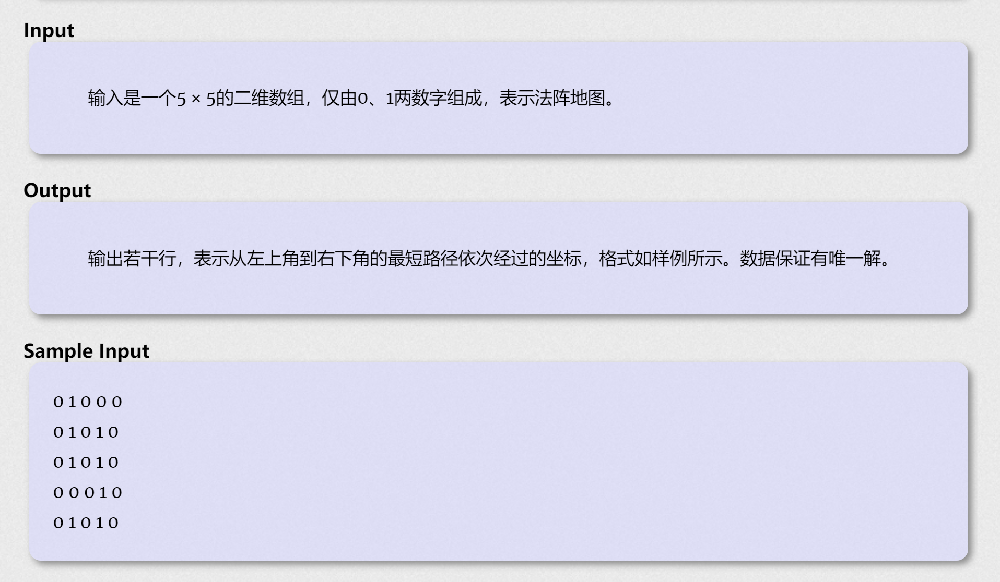

本周bfs专题训练

<!--more-->

## T1 Maze

### 题目描述

​		东东有一张地图，想通过地图找到妹纸。地图显示，0表示可以走，1表示不可以走，左上角是入口，右下角是妹纸，这两个位置保证为0。既然已经知道了地图，那么东东找到妹纸就不难了，请你编一个程序，写出东东找到妹纸的最短路线。



### 题目分析

- 起点终点已经确定，地图大小也已经确定，因此无需考虑数据，直接从起点bfs即可。

- 由于要求输出路径而不是步数，因此每次转移时需要记录上一个状态，在到达终点后直接倒序输出就可以了。

- 可以用指针或者数组模拟指针来记录历史状态。

- 一个位置能不能走到的前提有两个：1. 没有墙 2. 之前没有走过。

- 四个方向行走可以用经典的方法：开两个数组，分别代表向四个方向移动的坐标变化。

### 代码

```c++
int map[10][10];
bool v[10][10];
struct cord{
    int x,y;
    cord* from; //用来记录之前的状态
    cord(int x,int y,cord* from = NULL):x(x),y(y),from(from){}
};
int zx[4] = {0,0,1,-1};
int zy[4] = {1,-1,0,0};
inline void output(cord* last){
    if(last->from == NULL){
        cout<<"(0, 0)\n";
        return;
    }else{
        output(last->from);
        cout<<"("<<last->x-1<<", "<<last->y-1<<")\n";
    }
}
void bfs(){
    queue<cord*> q;
    q.push(new cord(1,1));
    v[1][1] = 1;
    while(!q.empty()){
        cord* now = q.front();
        q.pop();
        for(int i=0;i<4;i++){
            int tx = now->x + zx[i];
            int ty = now->y + zy[i];
            if(tx < 6 && tx >0 && ty < 6 && ty > 0 && map[tx][ty] == 0&& !v[tx][ty]){
                if(tx == 5&&ty == 5){
                    output(new cord(tx,ty,now));
                    return;
                }
                else {
                    v[tx][ty] = 1;
                    q.push(new cord(tx,ty,now));
                }
            }
        }
    }
}
int main(){
    for(int i = 1;i<=5;i++){
        for(int j = 1;j<=5;j++){
            cin>>map[i][j];
        }
    }
    bfs();
    return 0;
}
```

## T2 Pour Water

### 题目描述

经典的倒水问题，有两个容量分别为A，B升的杯子，每个杯子支持三种操作：

1. 把杯子倒满
2. 把杯子倒空
3. 把这个杯子里的水倒到另一个杯子

问能不能倒出C升的水

保证A，B互质。

输出**操作次数最少**的操作流程（不唯一）。

### 题目分析

- xxx最少balabalabala，用bfs比较多（当然本期主题是bfs  ~~康复训练~~ 练习）
- 一个杯子支持三个操作，那么两个杯子支持六种操作。也就是对于某个时刻的两个杯子，下一个时刻可能存在的状态有六种，其实也就是bfs时最多产生六个分支。
- 用面向对象思想，给每个bottle写三个方法：$ pourIn(),pourOut(),pourTo(bottle\&) $ 分别代表三种操作。这样写出来的代码比较清晰明了。（虽然看上去很长2333）
- 输出操作流程。和上一题同样的思想，用指针记录上一个状态，最后倒序输出。不太一样的是还要多记录一个opt：从上一个状态到当前状态的操作（倒满/倒空/倒到另一个杯子）
- 同时也要开一个数组记录当前状态是否达到过，如果到过就不用重复入队了。

### 代码

```c++
struct bottle{
    int capicity;
    int water;
    // 三种操作
    void pourTo(bottle& b){
        b.water = b.water+this->water;
        if(b.water > b.capicity){
            this->water = b.water - b.capicity;
            b.water = b.capicity;
        }else{
            this->water = 0;
        }
    }
    void pourOut(){
        this->water = 0;
    }
    void pourIn(){
        this->water = this->capicity;
    }
    bottle(int x):capicity(x){
        water = 0;
    }
};
struct sta{
    // 再抽象出一个状态，该状态包括某个时刻的两个杯子
    bottle A,B;
    sta* last;
    int opt;
    sta(bottle A,bottle B,sta* last):A(A),B(B),last(last){}
};
void output(sta* his){
    if(his!=NULL){
        output(his->last);
        switch (his->opt)
        {
        case 1:
            cout<<"fill A\n";
            break;
        case 2:
            cout<<"empty A\n";
            break;
        case 3:
            cout<<"pour A B\n";
            break;
        case 4:
            cout<<"fill B\n";
            break;
        case 5:
            cout<<"empty B\n";
            break;
        case 6:
            cout<<"pour B A\n";
            break;
        default:
            break;
        }
    }else{
        return;
    }
}
int v[1010][1010];
void bfs(int a,int b,int c){
    memset(v,0,sizeof(v));
    sta* status = new sta(bottle(a),bottle(b),NULL);
    queue<sta*> q;
    v[0][0] = 1; 
    q.push(status);
    while(!q.empty()){
        sta* head = q.front();
        for(int i = 1;i<=6;i++){
            sta* f = new sta(*head);
            switch(i){
                case 1:{
                    f->A.pourIn();
                    break;
                }
                case 2:{
                    f->A.pourOut();
                    break;
                }
                case 3:{
                    f->A.pourTo(f->B);
                    break;
                }
                case 4:{
                    f->B.pourIn();
                    break;
                }
                case 5:{
                    f->B.pourOut();
                    break;
                }
                case 6:{
                    f->B.pourTo(f->A);
                    break;
                }
            }
            if(!v[f->A.water][f->B.water]){
                v[f->A.water][f->B.water] = 1;
                f->last = head;
                f->opt = i;
                if(f->A.water == c || f->B.water == c){
                    output(f);
                    cout<<"success\n";
                    return;
                }else q.push(f);
            }
        }
        q.pop();
    }
}
int main(){
    int a,b,c;
    while(cin>>a>>b>>c){
        bfs(a,b,c);
    }
    return 0;
}
```

### 反思

可以用函数数组来改写一下：

```c++
void (*p[6])(bottle& a,bottle& b) //定义

for(int i = 0;i < 6;i++){
    p[i](a,b); //使用
}
```

不过这就得定义六个函数，代码量不一定能减少多少，只是提供一种思路。