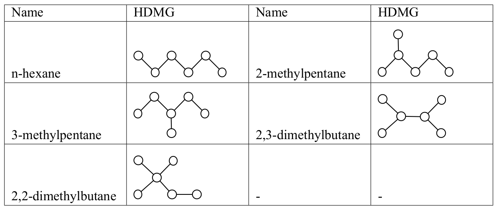
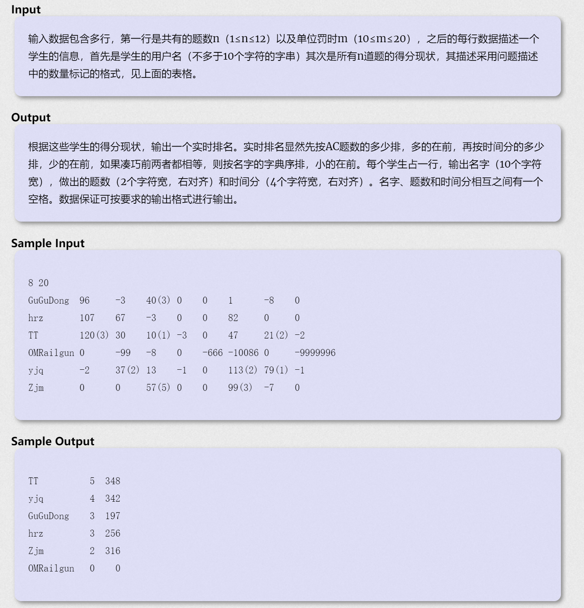

 本周三道大模拟 超时10min写完

<!--more-->

## T1 [Gym 270437A](https://vjudge.net/problem/3168416/origin)

### 题目描述



假设如上图，这个烷烃基有6个原子和5个化学键，6个原子分别标号1~6，然后用一对数字 a,b 表示原子a和原子b间有一个化学键。这样通过5行a,b可以描述一个烷烃基

你的任务是甄别烷烃基的类别。

原子没有编号方法，比如
1 2
2 3
3 4
4 5
5 6
和
1 3
2 3
2 4
4 5
5 6
是同一种，本质上就是一条链，编号其实是没有关系的

### 题目分析

- 首先观察输入，是一个图。

- 再找出判断五种烷烃的区别，可以发现n-hexane、2,2-dimethylbutane分别最多只有2度、4度节点；其他三种都是最多3度节点，但是2,3-dimethylbutane有两个3度节点；
- 剩下两个不太容易判断。考虑从其3度节点跑dfs找deep，2-methylpentance的deep为4，2-methylpentance的deep为3. 因为是戊烷所以不用考虑太多复杂度。

### 代码

```c++
int to[10],nex[10],head[10],p,di[10],vis[10];
void add(int a,int b){
    p++;
    to[p] = b; // 一开始写成a了 真的拉跨
    nex[p] = head[a];
    head[a] = p;
}
int dfs(int i,int dep){
    int maxx = 0;
    vis[i]=1;
    for(int e = head[i];e;e=nex[e]){
        if(!vis[to[e]]){
            maxx = max(maxx,dfs(to[e],dep+1));
        }
    }
    return (maxx == 0) ? dep : maxx;
}
int main(){
    int T;
    cin>>T;
    while(T--){
        p=0;
        for(int i=0;i<10;i++){
            to[i] = nex[i] = head[i] = di[i] = vis[i] =0;
        }
        for(int i =1;i<=5;i++){
            int a,b;
            cin>>a>>b;
            add(a,b);
            add(b,a);
            di[a]++;// 记录度数
            di[b]++;
        }
        int maxx = 0;
        for(int i =1;i<=6;i++){
            maxx = max(di[i],maxx);
        }
        if(maxx == 4){
            cout<<"2,2-dimethylbutane\n";
        }else if(maxx == 2){
            cout<<"n-hexane\n";
        }else{
            int dep = 1;
            int cont = 0;
            for(int i =1;i<=6;i++){
                if(di[i] == 3){
                    cont++;
                    dep = dfs(i,dep);
                }
            }
            // cout<<dep<<"\n";
            if(cont == 2){
                cout<<"2,3-dimethylbutane\n";
            }else if(dep == 3){
                cout<<"3-methylpentane\n";
            }else{
                cout<<"2-methylpentane\n";
            }
        }
    }
}
```

### 反思

其实一开始从度数入手找特征是没有问题的，只是第二个和第三个很遗憾没找出来，选用dfs最后调了半天（有这时间T3早A了）

第二个和第三个的特征为：三度节点连接的节点的度数和不同，分别为4/5.

> 多思考 代码少

## T2 [HDU 2093](https://vjudge.net/problem/16428/origin)

### 题目描述

某次考试一共八道题（A,B,C,D,E,F,G,H），每个人做的题都在对应的题号下有个数量标记，负数表示该学生在该题上有过的错误提交次数但到现在还没有AC，正数表示AC所耗的时间，如果正数a跟上了一对括号，里面有个正数b,则表示该学生AC了这道题，耗去了时间a，同时曾经错误提交了b次。例子可见下方的样例输入与输出部分。



### 题目分析

- $ 总时间 = 罚时 + 实际总时长 = 单位罚时\times错误提交次数 + 实际总时长$
- 第一关键字：通过题数、第二关键字：总时间
- 某道题上是负数说明最终也未通过，就算通过也可能会跟上“（负数）”表示有错误提交需要加罚时。
- ticks：
  - 读入时使用$stoi()$函数进行str2int的转换
  - 输出时使用

```c++
cout.width(10);
cout.setf(ios::left);
cout.unsetf(ios::left);
```
​			进行宽度控制

## 代码

```c++
const int maxx = 2e5;
struct rec{
    string name;
    int score;
    int ac;
}names[maxx];
bool cmp(rec a,rec b){
    if(a.ac == b.ac){
        return a.score<b.score;
    }else{
        return a.ac>b.ac;
    }
}
int main(){
    int n,m;
    cin>>n>>m;
    string s;
    int cnt = 0;
    while(cin>>s){
        names[cnt].name = s;
        for(int i =1;i<=n;i++){
            cin>>s;
            string::size_type sz;
            int score = stoi(s,&sz); //sz为原字符串中int结束的位置 后边可以切割用
            if(score > 0){
                names[cnt].ac++;
                names[cnt].score += score;
                if(s[s.length()-1] == ')'){
                    int fashi = stoi(s.substr(sz+1));
                    names[cnt].score += fashi*m;
                }
            }
        }
        cnt++;
    }
    sort(names,names+cnt,cmp);
    for(int i = 0;i<cnt;i++){
        cout.width(10);
        cout.setf(ios::left);
        cout<<names[i].name<<" ";
        cout.width(2);
        cout.unsetf(ios::left);
        cout<<names[i].ac<<" ";
        cout.width(4);
        cout<<names[i].score<<"\n";
    }
    
}
```

## T3 [POJ 1786](https://vjudge.net/problem/18591/origin)

### 题目描述

​       牌局由四个人构成，围成一圈。我们称四个方向为北 东 南 西。对应的英文是North，East，South，West。游戏一共由一副扑克，也就是52张构成。开始，我们指定一位发牌员（东南西北中的一个，用英文首字母标识）开始发牌，发牌顺序为顺时针，发牌员第一个不发自己，而是发他的下一个人（顺时针的下一个人）。这样，每个人都会拿到13张牌。
现在我们定义牌的顺序，首先，花色是（梅花）<（方片）<（黑桃）<（红桃），（输入时，我们用C,D,S,H分别表示梅花，方片，黑桃，红桃，即其单词首字母）。对于牌面的值，我们规定2 < 3 < 4 < 5 < 6 < 7 < 8 < 9 < T < J < Q < K < A。
现在你作为上帝，你要从小到大排序每个人手中的牌，并按照给定格式输出。（具体格式见输出描述和样例输出）。

#### 输入

输入包含多组数据
每组数据的第一行包含一个大写字符，表示发牌员是谁。如果该字符为‘#’则表示输入结束。
接下来有两行，每行有52个字符，表示了26张牌，两行加起来一共52张牌。每张牌都由两个字符组成，第一个字符表示花色，第二个字符表示数值。

```
N
CTCAH8CJD4C6D9SQC7S5HAD2HJH9CKD3H6D6D7H3HQH4C5DKHKS9
SJDTS3S7S4C4CQHTSAH2D8DJSTSKS2H5D5DQDAH7C9S8C8S6C2C3
#
```

#### 输出

输出多组数据发牌的结果，**每组数据**之后需要**额外多输出一个空行**
每组数据应该由24行的组成，输出按照顺时针方向，**始终先输出South Player**的结果，每位玩家先输出一行即玩家名称（东南西北），接下来五行，第一行和第五行输出固定格式（见样例），第二行和第四行按顺序和格式输出数值（见样例），第三行按顺序和格式输出花色（见样例）。

```
South player:
+---+---+---+---+---+---+---+---+---+---+---+---+---+
|6 6|A A|6 6|J J|5 5|6 6|7 7|9 9|4 4|5 5|7 7|9 9|T T|
| C | C | D | D | S | S | S | S | H | H | H | H | H |
|6 6|A A|6 6|J J|5 5|6 6|7 7|9 9|4 4|5 5|7 7|9 9|T T|
+---+---+---+---+---+---+---+---+---+---+---+---+---+
West player:
+---+---+---+---+---+---+---+---+---+---+---+---+---+
|2 2|5 5|9 9|K K|5 5|7 7|9 9|4 4|T T|J J|A A|8 8|A A|
| C | C | C | C | D | D | D | S | S | S | S | H | H |
|2 2|5 5|9 9|K K|5 5|7 7|9 9|4 4|T T|J J|A A|8 8|A A|
+---+---+---+---+---+---+---+---+---+---+---+---+---+
North player:
+---+---+---+---+---+---+---+---+---+---+---+---+---+
|3 3|4 4|J J|2 2|3 3|T T|Q Q|K K|8 8|Q Q|K K|2 2|3 3|
| C | C | C | D | D | D | D | D | S | S | S | H | H |
|3 3|4 4|J J|2 2|3 3|T T|Q Q|K K|8 8|Q Q|K K|2 2|3 3|
+---+---+---+---+---+---+---+---+---+---+---+---+---+
East player:
+---+---+---+---+---+---+---+---+---+---+---+---+---+
|7 7|8 8|T T|Q Q|4 4|8 8|A A|2 2|3 3|6 6|J J|Q Q|K K|
| C | C | C | C | D | D | D | S | S | H | H | H | H |
|7 7|8 8|T T|Q Q|4 4|8 8|A A|2 2|3 3|6 6|J J|Q Q|K K|
+---+---+---+---+---+---+---+---+---+---+---+---+---+
```

### 题目分析

- 首先用`vector<pair<char,char>> player[4]` 表示每个玩家摸到牌的数组，`pair<char,char>`代表牌上的花色和字母。
- 假设我们不考虑是谁发牌，那么直接两个for把牌依次读取到player数组，然后直接进行双关键字排序即可，因为这两个步骤不涉及输出。
- 但是我们要考虑发牌的人，因为这关系到输出，因此考虑x发牌的第几个下家是South。我们记这个数为n，那么输出循环中就需要依次输出`player[n+i]`的序列。这里需要思考一下，确实不太好转过弯来，这时候就可以先输出试一下。

- 包括规则和玩家代号在内有很多映射，因此我们使用map记录。oj不支持c++11，因此我们只能直接在main函数里给出各种映射，这里可以使用一些小tricks简化代码。
- 记得加换行！！！

### 代码

```C++
typedef vector<pair<char,char> > Pyr;
Pyr players[4]; 
string s[4] = {"South player:\n","West player:\n","North player:\n","East player:\n"};
string cut = "+---+---+---+---+---+---+---+---+---+---+---+---+---+\n";
map<char,int> m;
map<char,int> flw;
map<char,char> num;
bool cmp(pair<char,char> a,pair<char,char> b){
    if(flw[a.first] == flw[b.first]){
        return num[a.second] < num[b.second];
    }else{
        return flw[a.first]<flw[b.first];
    }
}
int main(){
    char starter;
    num['T'] = '9'+1;
    num['J'] = '9'+2;
    num['Q'] = '9'+3;
    num['K'] = '9'+4;
    num['A'] = '9'+5;
    flw['C'] = 0;
    flw['D'] = 1;
    flw['S'] = 2;
    flw['H'] = 3;
    m['N'] = 1;
    m['E'] = 0;
    m['S'] = 3;
    m['W'] = 2;
    for(int i =2;i<=9;i++){
        num['0'+i] = '0'+i;
    }
    while(cin>>starter){
        if(starter == '#')break;
        for(int i = 1;i<=13;i++){
            for(int j=0;j<4;j++){
                char a,b;
                cin>>a>>b;
                players[j].push_back(make_pair(a,b));
            }
        }
        for(int i =0;i<4;i++){
            sort(players[i].begin(),players[i].end(),cmp);
        }
        int cnt = m[starter];
        for(int i =0;i<4;i++){
            int k = (cnt+i)%4;
            cout<<s[i];
            cout<<cut;
            for(int i =0;i<13;i++){
                cout<<"|"<<players[k][i].second<<" "<<players[k][i].second<<"";
            }
            cout<<"|\n";
            for(int i =0;i<13;i++){
                cout<<"| "<<players[k][i].first<<" ";
            }
            cout<<"|\n";
            for(int i =0;i<13;i++){
                cout<<"|"<<players[k][i].second<<" "<<players[k][i].second<<"";
            }
            cout<<"|\n";
            cout<<cut;
        }cout<<"\n";
        for(int i =0;i<4;i++){
            players[i].clear();
        }
    }
    return 0;
}
```

