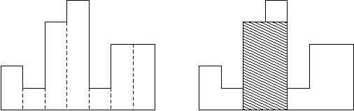

本周线性数据结构专题

<!--more -->

### [A - 最大矩形](https://vjudge.net/contest/363023#problem/A)

#### 题目描述

给一个直方图，求直方图中的最大矩形的面积。例如，下面这个图片中直方图的高度从左到右分别是2, 1, 4, 5, 1, 3, 3, 他们的宽都是1，其中最大的矩形是阴影部分。



##### 输入

输入包含多组数据。每组数据用一个整数n来表示直方图中小矩形的个数，你可以假定1 <= n <= 100000. 然后接下来n个整数h1, ..., hn, 满足 0 <= hi <= 1000000000. 这些数字表示直方图中从左到右每个小矩形的高度，每个小矩形的宽度为1。 测试数据以0结尾。

##### 输出

对于每组测试数据输出一行一个整数表示答案。

#### 题目分析

- 对于某一列，以其位高构成的最大矩形的左右两端应当是：向左右两端找到第一个高度小于该列的位置‘
- 单调栈可以$O(n)$地解决查找某元素某侧第一个最小值问题；
- 那么单调栈向左扫一次向右扫一次即可解决

### 代码

```c++
int rigt[200000],lef[200000];
struct rec{
    long long data;
    int pos;
}k[200000];
int main(){
    int n;
    while(cin>>n){
        if(n == 0)break;
        stack<rec> s;
        for(int i = 0;i<n;i++){
            cin>>k[i].data;
            k[i].pos = i;
            while(!s.empty()&&s.top().data>k[i].data){
                rigt[s.top().pos] = i;
                s.pop();
            }
            s.push(k[i]);
        }
        while(!s.empty()){
            rigt[s.top().pos] = n;
            s.pop();
        }
        for(int i = n-1;i>=0;i--){
            while(!s.empty()&&s.top().data>k[i].data){
                lef[s.top().pos] = i;
                s.pop();
            }
            s.push(k[i]);
        }
        while(!s.empty()){
            lef[s.top().pos] = -1;
            s.pop();
        }
        long long ans = 0;
        for(int i = 0;i<n;i++){
            ans = max(ans,k[i].data*(rigt[i]-lef[i]-1));
        }
        cout<<ans<<"\n";
    }
    return 0;
}
```


### [B - TT's Magic Cat](https://vjudge.net/problem/Gym-272542A)

### 题目描述

给定一段序列，要求支持连续区间上的加法，输出操作结束后的序列。

##### 输入

长度为n的序列，q次操作

##### 输出

q次操作后的序列

#### 题目分析

- 用差分数组进行预处理，则可以将区间操作转化为单点操作。对`[l,r]`区间上的加法变为差分数组`c`上`c[l]+`和`c[r+1]-`
- 差分数组对应的前缀和数组就是最终答案

### 代码

```c++
long long minu[300000];
long long a[300000];
int main(){
    ios::sync_with_stdio(false); //会卡输入
    int n,q;
    cin>>n>>q;
    for(int i = 1;i<=n;i++){
        cin>>a[i];
    }
    for(int i = 1;i<=n;i++){
        minu[i] = a[i]-a[i-1];
    }
    for(int j = 1;j<=q;j++){
        int l,r,c;
        cin>>l>>r>>c;
        minu[l] += c;
        minu[r+1] -= c;
    }
    long long ans =0;
    for(int i = 1;i<=n;i++){
        ans += minu[i];
        cout<<ans<<" ";
    }
    return 0;
}
```

### [C - 平衡字符串](https://vjudge.net/problem/Gym-270737B)

#### 题目描述

一个长度为 n 的字符串 s，其中仅包含 'Q', 'W', 'E', 'R' 四种字符。

如果四种字符在字符串中出现次数均为 n/4，则其为一个平衡字符串。

现可以将 s 中连续的一段子串替换成相同长度的只包含那四个字符的任意字符串，使其变为一个平衡字符串，问替换子串的最小长度?

如果 s 已经平衡则输出0。

##### 输入

一行字符串

##### 输出

一个整数表示答案

#### 题目分析

- 关键字：连续

- 考虑尺取方法：对于一个子串s’ 如果替换掉s‘可以形成平衡串，则有可能可以取更短，`Left pointer++`；

  否则应该考虑更长的串，`right pointer++`

- 如何判断取一个子串s'时是否能形成平衡串？

  考虑平衡串的性质：

  - 分别统计串外四种字母的数目，取四者max，再用max减去剩余三个字母的数目，得到要“填充”的字母数
  - 子串长度与上述数比较，如果子串较长，则再用子串长减去要“填充”到外面的字母数，如果余下的数是四的倍数则满足要求。

- 注意：如果`right pointer`越界则直接结束（不可能再满足要求）

#### 代码

```c++
int count[5];
map<char,int> mp;
int main(){
    ios::sync_with_stdio(false);
    string s;
    cin>>s;
    mp['Q'] = 0;
    mp['W'] = 1;
    mp['E'] = 2;
    mp['R'] = 3;
    for(int i = 0;i<s.size();i++){
        count[mp[s[i]]]++;
    }
    if(count[0] == count[1] && count[1] == count[2] && count[2]== count[3]){
        cout<<0;
    }else {
        int l = -1,r = 0;
        count[mp[s[r]]]--;
        int ans = INT32_MAX;
        while(l != r && r < s.size()){
            int maxx = max(count[0],max(count[1],max(count[2],count[3])));
            int tot = 0;
            for(int i = 0;i<4;i++){
                tot += maxx-count[i];
            }
            // cout<<l<<" "<<r<<" "<<tot<<"\n";
            if(tot <= (r-l) && (r-l-tot) %4 == 0){
                ans = min(ans,r-l);
                l++;
                count[mp[s[l]]]++;
            }else {
                r++;
                count[mp[s[r]]]--;
            }
        }
        cout<<ans;
    }
    return 0;
}
```

### [D - 滑动窗口](https://vjudge.net/problem/POJ-2823)

#### 题目描述

ZJM 有一个长度为 n 的数列和一个大小为 k 的窗口, 窗口可以在数列上来回移动. 现在 ZJM 想知道在窗口从左往右滑的时候，每次窗口内数的最大值和最小值分别是多少. 例如：
数列是 [1 3 -1 -3 5 3 6 7], 其中 *k* 等于 3.

| Window position     | Minimum value | Maximum value |
| ------------------- | ------------- | ------------- |
| [1 3 -1] -3 5 3 6 7 | -1            | 3             |
| 1 [3 -1 -3] 5 3 6 7 | -3            | 3             |
| 1 3 [-1 -3 5] 3 6 7 | -3            | 5             |
| 1 3 -1 [-3 5 3] 6 7 | -3            | 5             |
| 1 3 -1 -3 [5 3 6] 7 | 3             | 6             |
| 1 3 -1 -3 5 [3 6 7] | 3             | 7             |

##### 输入

输入有两行。第一行两个整数n和k分别表示数列的长度和滑动窗口的大小，1<=k<=n<=1000000。第二行有n个整数表示ZJM的数列。

##### 输出

输出有两行。第一行输出滑动窗口在从左到右的每个位置时，滑动窗口中的最小值。第二行是最大值。

#### 题目分析

- 单调栈是解决整个序列范围内的问题
- 如果对序列加上区间限制，则需要把”过期“的栈底元素弹出栈，就变成了单调队列
- 因此单调队列不是严格队列，而是双端队列
- 具体实现上只要每次入栈（队列）时判断一下当前位置和队首元素位置的差是否大于区间长度。如果大则弹出队首即可。
- tips: 最大最小值可以在一个循环里同时维护。

#### 代码

```c++
int n,k;
long long minx[2000000];
long long maxx[2000000];
struct rec{
    int pos;
    long long data;
};
int main(){
    ios::sync_with_stdio(false);
    cin>>n>>k;
    deque<rec> q1,q2;
    for(int i = 1;i <= n;i++){
        rec d;
        cin>>d.data;
        d.pos = i;
        if(!q1.empty() && q1.front().pos <= i-k){
            q1.pop_front();
        }
        while(!q1.empty() && q1.back().data > d.data){
            q1.pop_back();
        }
        q1.push_back(d);
        minx[i] = q1.front().data;
        if(!q2.empty() && q2.front().pos <= i-k){
            q2.pop_front();
        }
        while(!q2.empty() && q2.back().data < d.data){
            q2.pop_back();
        }
        q2.push_back(d);
        maxx[i] = q2.front().data;
    }
    for(int i = k;i<=n;i++) cout<<minx[i]<<" ";
    cout<<'\n';
    for(int i = k;i<=n;i++) cout<<maxx[i]<<" ";
    return 0;
}
```

### 总结

线性数据结构用于解决某些特定问题时时间复杂度十分优秀，但是寻找思路比较难。