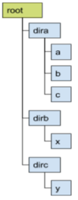
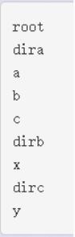

博客一定不能拖，不能拖

<!-- more -->

### [A-咕咕东的目录管理器](https://vjudge.net/contest/368394#problem/A)

#### 题目描述

咕咕东的雪梨电脑的操作系统在上个月受到宇宙射线的影响，时不时发生故障，他受不了了，想要写一个高效易用零bug的操作系统 —— 这工程量太大了，所以他定了一个小目标，从实现一个目录管理器开始。前些日子，东东的电脑终于因为过度收到宇宙射线的影响而宕机，无法写代码。他的好友TT正忙着在B站看猫片，另一位好友瑞神正忙着打守望先锋。现在只有你能帮助东东！

初始时，咕咕东的硬盘是空的，命令行的当前目录为根目录 `root`。

目录管理器可以理解为要维护一棵有根树结构，每个目录的儿子必须保持**字典序。**



现在咕咕东可以在命令行下执行以下表格中描述的命令：

| 命令      | 类型 | 实现                                                         | 说明                                                         |
| --------- | ---- | ------------------------------------------------------------ | ------------------------------------------------------------ |
| MKDIR *s* | 操作 | 在当前目录下创建一个子目录 *s*，*s* 是一个字符串             | 创建成功输出 "OK"；若当前目录下已有该子目录则输出 "ERR"      |
| RM *s*    | 操作 | 在当前目录下删除子目录 *s*，*s* 是一个字符串                 | 删除成功输出 "OK"；若当前目录下该子目录不存在则输出 "ERR"    |
| CD *s*    | 操作 | 进入一个子目录 s，*s* 是一个字符串（执行后，当前目录可能会改变） | 进入成功输出 "OK"；若当前目录下该子目录不存在则输出 "ERR" 特殊地，若 *s* 等于 ".." 则表示返回上级目录，同理，返回成功输出 “OK”，返回失败（当前目录已是根目录没有上级目录）则输出 “ERR” |
| SZ        | 询问 | 输出当前目录的大小                                           | 也即输出 1+当前目录的子目录数                                |
| LS        | 询问 | 输出多行表示当前目录的 "直接子目录" 名                       | 若没有子目录，则输出 "EMPTY"；若子目录数属于 [1,10] 则全部输出；若子目录数大于 10，则输出前 5 个，再输出一行 "…"，输出后 5 个。 |
| TREE      | 询问 | 输出多行表示以当前目录为根的子树的前序遍历结果               | 若没有后代目录，则输出 "EMPTY"；若后代目录数+1（当前目录）属于 [1,10] 则全部输出；若后代目录数+1（当前目录）大于 10，则输出前 5 个，再输出一行 "…"，输出后 5 个。若目录结构如上图，当前目录为 "root" 执行结果如下， |
| UNDO      | 特殊 | 撤销操作                                                     | 撤销最近一个 "成功执行" 的操作（即MKDIR或RM或CD）的影响，撤销成功输出 "OK" 失败或者没有操作用于撤销则输出 "ERR" |

##### 输入

输入文件包含多组测试数据，第一行输入一个整数表示测试数据的组数 T （T <= 20）；

每组测试数据的第一行输入一个整数表示该组测试数据的命令总数 Q （Q <= 1e5）；

每组测试数据的 2 ~ Q+1 行为具体的操作 （MKDIR、RM 操作总数不超过 5000）；

##### 输出

每组测试数据的输出结果间需要输出一行空行。注意大小写敏感。

#### 题目分析

- 因为有各种操作，且各种操作都是基于“目录”的，因此可以将操作直接封装到dir类里，调用时更清晰，也方便debug。
- 从数据范围可以知道，每次直接遍历求Tree/Size的话会直接爆炸（$1e5\times 5k\times 20$）
- MKDIR就是加入子节点，RM就是减去子节点，CD就是将当前节点换到某个指定的子节点，LS判断一下儿子节点个数输出即可，较容易实现；
- 在进行上述操作（MKDIR/RM）时，同时维护根节点到当前增删的节点路径上的所有节点的Size值，那么sz操作即可O(1)；
- TREE操作中，要求输出先序遍历的前后五个比较麻烦。但是可以注意到Q远大于MKDIR的数量，也就是说必然有很多Q重复询问同一节点；
  - 字典序可以用map或者set快速实现；
  - 那么我们可以考虑懒操作：只有当访问某节点的pre（前序前五个元素）和bck（前序后五个）且该节点的子树上发生过增/删节点操作时，才重新计算Tree；且要求的是前后五个，那么前五个就是从最左边的儿子节点pre数组开始找，后五个就是从最右边的bck数组开始找；
  - 那么如此操作则将问题下放到了儿子节点，从而用相关的儿子节点信息进行本身的更新。本质上跟带lazy标记的线段树思想是相同的；
  - 那么MKDIR/RM的同时还需要维护一个lazy标记表示某节点的子树中发生了更改，之前的信息不可用需要重新计算；
- 最后是UNDO操作，仅和增删和CD操作发生互动。
  - 直接建立一个history栈，把MKDIR、RM、CD操作都压进栈，取出的时候逆向操作一下就可。
  - 值得注意的是，如果将某个有子节点的节点删除，UNDO的时候也要把子节点一起恢复，也就是说建A—...—删A—建A—UNDO—UNDO的时候恢复的应该是第一次简历的A及其子目录。因此就算同名文件夹也不能覆盖掉之前的同名记录。

#### 代码

```c++
#include<iostream>
#include<vector>
#include<algorithm>
#include<stack>
#include<map>
using namespace std;
const int maxn = 1e6+10;
int p;
struct Dir{
    int size,father;
    int id;
    string name;
    bool tag;
    map<string,int> child;
    vector<string> pre,bck;
    void init(string s,int fa,int idd){
        name = s;
        father = fa;
        id = idd;
        tag = 0;
        size = 1;
        pre.clear();bck.clear();child.clear();
    }
    int rm(string s){
        if(!child.count(s)) {cout<<"ERR\n";return -1;}
        else {
            int k = child[s];
            child.erase(s);
            cout<<"OK\n";
            return k;
        }
    }
    int cd(string s){
        if((s != ".." && !child.count(s) )|| (s == ".." && father == -1)) {cout<<"ERR\n";return -1;}
        else {
            cout<<"OK\n";
            if(s == "..") return father;
            else return child[s];
        }
    }
    void ls(){
        if(child.size() > 10){
            int k = 5;
            auto i = child.begin();
            while(k--){
                cout<<i->first<<"\n";
                i++;
            }
            i = child.end();
            cout<<"...\n";
            while(++k<5) i--;
            while(k--){cout<<i->first<<"\n";i++;}
        }else if(child.size() == 0 ){
            cout<<"EMPTY\n";
        }else {
            for(auto &i:child){
                cout<<i.first<<"\n";
            }
        }
    }
}node[maxn];
int mkdir(int id,string s){
    if(node[id].child.count(s)){ cout<<"ERR\n";return -1;}
    else {
        p++;
        node[id].child[s] = p;
        node[p].init(s,id,p);
        cout<<"OK\n";
        return p;
    }
}
struct Commander{
    int now;
    stack<pair<string,pair<string,int> > >his;
    void update(int id,int num){
        while(id != -1){
            node[id].size += num;
            node[id].tag = 0;
            id = node[id].father;
        }
    }
    void order(string order,string s=""){
        if(order == "MKDIR") {
            int k = mkdir(now,s);
            if(k!=-1) {
                update(now,1);
                his.push(make_pair(order,make_pair(s,k)));
            }
        }
        if(order == "SZ") {
            cout<<node[now].size<<"\n";
        }
        if(order == "RM") {
            int k = node[now].rm(s);
            if(k!=-1) {
                update(now,-node[k].size);
                his.push(make_pair(order,make_pair(s,k)));
            }
        }
        if(order == "LS") {
            node[now].ls();
        }
        if(order == "CD") {
            int k  = node[now].cd(s);
            if(k != -1){
                his.push(make_pair(order,make_pair("",now)));
                now = k;
            }
        }
        if(order == "TREE") {
            tree();
        }
        if(order == "UNDO") {
            undo();
        }
    }
    void undo(){
        if(his.size()){
            pair<string,pair<string,int> > pre = his.top();
            his.pop();
            if(pre.first == "CD") {
                now = pre.second.second;
                cout<<"OK\n";
            }
            if(pre.first == "MKDIR") {
                int k = pre.second.second;
                node[now].child.erase(pre.second.first);
                update(now,-node[k].size);
                cout<<"OK\n";
            }
            if(pre.first == "RM") {
                int k = node[now].child[pre.second.first] = pre.second.second;
                update(now,node[k].size);
                cout<<"OK\n";
            }
        }else {
            cout<<"ERR\n";
        }
    }
    void pretrack(int id){
        node[id].pre.push_back(node[id].name);
        for(auto &i:node[id].child){
            if(!node[i.second].tag) pushdown(i.second);
            int cnt = 0;
            while(node[id].pre.size() <= 20 && cnt < node[i.second].pre.size()){
                node[id].pre.push_back(node[i.second].pre[cnt++]);
            }
            if(node[id].pre.size() >= 10) return;
        }
    }
    void backtrack(int id){
        auto i = node[id].child.end();
        i--;
        for(;;i--) {
            if(!node[i->second].tag) pushdown(i->second);
            int cnt = 0;
            while(node[id].bck.size()<=20 && cnt < node[i->second].bck.size()){
                node[id].bck.push_back(node[i->second].bck[cnt++]);
            }
            if(node[id].bck.size() >= 5) return;
            if(i == node[id].child.begin()) return ; // 必须要把begin加进去！！
        }
    }
    void pushdown(int id){
        node[id].pre.clear();
        node[id].bck.clear();
        pretrack(id);
        if(node[id].size>10) backtrack(id);
        else {
            node[id].bck = node[id].pre;
            reverse(node[id].bck.begin(),node[id].bck.end());
        }
        node[id].tag = 1;
    }

    void tree(){
        if(!node[now].tag) pushdown(now);
        if(node[now].size == 1) cout<<"EMPTY\n";
        else if(node[now].size <=10) for(int i = 0;i<node[now].pre.size();i++) cout<<node[now].pre[i]<<"\n";
        else {
            int bsize = node[now].bck.size();
            if(bsize-1 < 4){
                backtrack(now);
            }
            {
                for(int i = 0;i<5;i++) cout<<node[now].pre[i]<<"\n";
                cout<<"...\n";
                for(int i = 4;i>=0;i--) cout<<node[now].bck.at(i)<<"\n";
            }
        }
    }
    void init(){
        now = 0;
        while(his.size()) his.pop();
        node[0].init("root",-1,0);
    }
}cmd;
int main(){
    ios::sync_with_stdio(false);
    int T;
    cin>>T;
    while(T--){
        p = 0 ;
        cmd.init();
        int Q;
        cin>>Q;
        for(int i = 1;i<=Q;i++){
            string s;
            cin>>s;
            if(s == "MKDIR" || s == "CD" || s == "RM" ){
                string ss;
                cin>>ss;
                cmd.order(s,ss);
            }else {
                cmd.order(s);
            }
        }
    }
}
```

### [B- 东东学打牌](https://vjudge.net/contest/368394#problem/B)

#### 题目描述

最近，东东沉迷于打牌。所以他找到 HRZ、ZJM 等人和他一起打牌。由于人数众多，东东稍微修改了亿下游戏规则：

- 所有扑克牌只按数字来算大小，忽略花色。
- 每张扑克牌的大小由一个值表示。A, 2, 3, 4, 5, 6, 7, 8, 9, 10, J, Q, K 分别指代 1, 2, 3, 4, 5, 6, 7, 8, 9, 10, 11, 12, 13。
- 每个玩家抽得 5 张扑克牌，组成一手牌！（每种扑克牌的张数是无限的，你不用担心，东东家里有无数副扑克牌）

理所当然地，一手牌是有不同类型，并且有大小之分的。

举个栗子，现在东东的 "一手牌"（记为 α），瑞神的 "一手牌"（记为 β），要么 α > β，要么 α < β，要么 α = β。

那么这两个 "一手牌"，如何进行比较大小呢？首先对于不同类型的一手牌，其值的大小即下面的标号；对于同类型的一手牌，根据组成这手牌的 5 张牌不同，其值不同。下面依次列举了这手牌的形成规则：

> 1. 大牌：这手牌不符合下面任一个形成规则。如果 α 和 β 都是大牌，那么定义它们的大小为组成这手牌的 5 张牌的大小总和。
> 2. 对子：5 张牌中有 2 张牌的值相等。如果 α 和 β 都是对子，比较这个 "对子" 的大小，如果 α 和 β 的 "对子" 大小相等，那么比较剩下 3 张牌的总和。
> 3. 两对：5 张牌中有两个不同的对子。如果 α 和 β 都是两对，先比较双方较大的那个对子，如果相等，再比较双方较小的那个对子，如果还相等，只能比较 5 张牌中的最后那张牌组不成对子的牌。
> 4. 三个：5 张牌中有 3 张牌的值相等。如果 α 和 β 都是 "三个"，比较这个 "三个" 的大小，如果 α 和 β 的 "三个" 大小相等，那么比较剩下 2 张牌的总和。
> 5. 三带二：5 张牌中有 3 张牌的值相等，另外 2 张牌值也相等。如果 α 和 β 都是 "三带二"，先比较它们的 "三个" 的大小，如果相等，再比较 "对子" 的大小。
> 6. 炸弹：5 张牌中有 4 张牌的值相等。如果 α 和 β 都是 "炸弹"，比较 "炸弹" 的大小，如果相等，比较剩下那张牌的大小。
> 7. 顺子：5 张牌中形成 x, x+1, x+2, x+3, x+4。如果 α 和 β 都是 "顺子"，直接比较两个顺子的最大值。
> 8. 龙顺：5 张牌分别为 10、J、Q、K、A。

作为一个称职的魔法师，东东得知了全场人手里 5 张牌的情况。他现在要输出一个排行榜。排行榜按照选手们的 "一手牌" 大小进行排序，如果两个选手的牌相等，那么人名字典序小的排在前面。

不料，此时一束宇宙射线扫过，为了躲避宇宙射线，东东慌乱中清空了他脑中的 Cache。请你告诉东东，全场人的排名

##### 输入

输入包含多组数据。每组输入开头一个整数 n (1 <= n <= 1e5)，表明全场共多少人。
随后是 n 行，每行一个字符串 s1 和 s2 （1 <= |s1|,|s2| <= 10）， s1 是对应人的名字，s2 是他手里的牌情况。

##### 输出

对于每组测试数据，输出 n 行，即这次全场人的排名。

#### 题目分析

- 确实没啥好分析的，题目说啥就写啥就行了
- 主要逻辑在运算符重载上，但是写的时候可读性挺差的，麻烦的地方在于对子/两对/三带二重复域的处理上。

#### 代码

```c++
#include<iostream>
#include<cstring>
#include<algorithm>
const int maxx = 1e5+100;
using namespace std;
struct p{
    string name;
    int cards[10];
    int num[20];
    int sum,prority,sMax,dNum,dui[5],san;
    void caculate(){
        dNum = sum = sMax = prority = sum = san = 0;
        for(int i = 1;i<=13;i++) num[i] = 0;
        for(int i = 0;i<5;i++){
            num[cards[i]]++;
        }
        if(num[1] && num[10] && num[11]&& num[12]&& num[13]) {
            prority = 8;
            return;
        }else {
            for(int i = 1;i<10;i++){
                if(num[i] && num[i+1] && num[i+2]&& num[i+3] && num[i+4]){
                    prority = 7;
                    sMax = i+4;
                    return;
                }
            }
            bool flag = 0;
            for(int i = 1;i<=13;i++){
                if(num[i] >= 4){
                    prority = 6;
                    sMax = i;
                    if(num[i] == 5) sum = i;
                }else 
                if(num[i] == 3){
                    prority = 5;
                    san = i;
                }else 
                if(num[i] == 2){
                    dui[dNum++] = i;
                }else if(num[i] == 1){
                    sum += i;
                }
            }
            return;
        }
    }
    bool operator <(const p& b) const {
        if(prority == b.prority){
            if(prority == 7) {
                if(sMax == b.sMax) return name < b.name;
                else return sMax > b.sMax;
            }else if(prority == 6){
                if(sMax == b.sMax) {
                    if(sum == b.sum) return name < b.name;
                    else return sum > b.sum;
                }else return sMax > b.sMax;
            }else if(prority == 5){
                if(dNum && b.dNum){
                    if(san == b.san){
                        if(dui[dNum-1] == b.dui[b.dNum-1]){
                            return name < b.name;
                        }else return dui[dNum-1] > b.dui[b.dNum-1];
                    }else return san > b.san;
                }else if(!dNum && !b.dNum){
                    if(san == b.san){
                        if(sum == b.sum) return name < b.name;
                        else return sum > b.sum;
                    }else return san > b.san;
                }else return dNum > b.dNum;
            }else {
                if(dNum == b.dNum ){
                    if(dNum == 2){
                        return dui[dNum-1] == b.dui[b.dNum-1] ? (
                            dui[dNum-2] == b.dui[b.dNum-2] ? (
                                sum == b.sum ? name < b.name : sum > b.sum
                            ) : dui[dNum-2] > b.dui[b.dNum-2]
                        ) : dui[dNum-1] > b.dui[b.dNum-1] ;
                    }
                    if(dNum == 1){
                        return dui[dNum-1] == b.dui[b.dNum-1] ? (
                            sum == b.sum ? name < b.name : sum > b.sum
                        ) : dui[dNum-1] > b.dui[b.dNum-1] ;
                    }
                    if(dNum == 0){
                        return sum == b.sum ?  name < b.name : sum > b.sum;
                    }
                }else return dNum > b.dNum;
            }
        }else return prority > b.prority;
    }
}Person[maxx];
int main(){
    int n;
    while(cin>>n){
        for(int i = 0;i<n;i++){
            cin >> Person[i].name;
            for(int j = 0;j <= 4;j++){
                char c;cin>>c;
                if(c == 'A'){
                    Person[i].cards[j] = 1;
                }else
                if(c == 'J'){
                    Person[i].cards[j] = 11;
                }else
                if(c == 'Q'){
                    Person[i].cards[j] = 12;
                }else
                if(c == 'K'){
                    Person[i].cards[j] = 13;
                }else
                if(c == '1'){
                    Person[i].cards[j] = 10;
                    cin>>c;
                }else
                Person[i].cards[j] = c-'0';
            }
            Person[i].caculate();
        }
        sort(Person,Person+n);
        for(int i = 0;i<n;i++){
            cout<<Person[i].name<<"\n";
        }
    }
}
```

### [C - 公园的长凳](https://vjudge.net/problem/CodeForces-1042A)

#### 题目描述

SDUQD 旁边的滨海公园有 x 条长凳。第 i 个长凳上坐着 a_i 个人。这时候又有 y 个人将来到公园，他们将选择坐在某些公园中的长凳上，那么当这 y 个人坐下后，记k = 所有椅子上的人数的最大值，那么k可能的最大值mx和最小值mn分别是多少。

##### 输入

第一行包含一个整数 x (1 <= x <= 100) 表示公园中长椅的数目
第二行包含一个整数 y (1 <= y <= 1000) 表示有 y 个人来到公园
接下来 x 个整数 a_i (1<=a_i<=100)，表示初始时公园长椅上坐着的人数

##### 输出

输出 mn 和 mx

#### 题目分析

- 记录最大值和总人数即可
  - mn：min（（y+总人数-最大值*x）/x，最大值）
  - mx：最大值+y

#### 代码

```c++
#include<iostream>
#include<cmath>
using namespace std;
int a[100];
int main(){
    int x,y,mx = 0;
    cin>>x>>y;
    for(int i = 1;i<=x;i++){
        cin>>a[i];
        mx = max(mx,a[i]);
    }
    int res = 0;
    for(int i = 1;i<=x;i++){
        res += mx - a[i];
    }
    if(y > res){
        cout<<ceil((y-res)/(double)x)+mx <<" "<< y+mx;
    }else {
        cout<<mx <<" "<< mx+y;
    }
    return 0;
}
```

