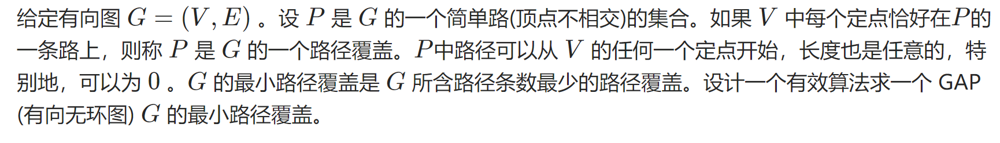

时隔多年的by终于想起来更新博客了

算是疫情推动吧 争取每日/隔日更新一篇不拖更

今天的题

[洛谷P2764最小路径覆盖问题]: https://www.luogu.com.cn/problem/P2764	"P2764最小路径覆盖问题"

<!-- more -->

#### 思路：

最小路径覆盖的定义



考虑最简单的图：如果图中没有边，那么每个点都相当于一条独立路径；添加一条边，那么**最小路径条数就-1**；此时再添加一条边，会产生两种情况：

新边与上一条边有相同的起点或终点，此时对答案**没有贡献**；

新边与上一条边首尾相连，或不相交，此时**最小路径条数-1**；

那么问题转化为：从一个有向无环图中选出尽可能多的边，使得**任意两条边没有相同的起点或终点**

也就是：

**|G|- 最大匹配 = 最小路径覆盖**

从而可以通过拆点+二分图匹配解决

至于二分图算法，使用dinic在拆点图上跑最大流即可

复杂度O(mn^2)

当然匈牙利算法也可 时间复杂度O(mn)

#### 代码：

```c++
#include<bits/stdc++.h>
using namespace std;

const int maxn = 150;
struct Node;
struct Edge;

struct Node{
    Edge *firstEdge;
    int id,level;
    bool visited;
}nodes[maxn*2+2];

struct Edge {
    Node *from, *to;
    int capacity,flow;
    Edge *next, *reversedEdge;

    Edge(Node *from,Node *to,int capacity):from(from),to(to),capacity(capacity),flow(0),next(from->firstEdge){};
};

int n,m;

inline void add(int a,int b,int c){
    nodes[a].firstEdge = new Edge(&nodes[a],&nodes[b],c);
    nodes[b].firstEdge = new Edge(&nodes[b],&nodes[a],0);
    nodes[a].firstEdge->reversedEdge = nodes[b].firstEdge;
    nodes[b].firstEdge->reversedEdge = nodes[a].firstEdge;
}

struct Dinic{
    bool makeLevelGraph(Node *s,Node *t, int n){
        for(int i = 0 ;i<n;i++) nodes[i].level = 0;
        queue<Node*>q;
        q.push(s);
        s->level = 1;
        
        while(!q.empty()){
            Node* h = q.front();
            q.pop();
            
            for(Edge* e = h->firstEdge;e;e=e->next){
                if(e->flow < e->capacity && e->to->level == 0){
                    e->to->level = h->level+1;
                    if(e->to == t )return true;
                    else q.push(e->to);
                }
            }
            
        }

        return false;
    }

    int findPath(Node *s,Node *t,int limit = INT_MAX){
        if(s == t)return limit;

        for(Edge *e = s->firstEdge;e;e = e->next){
            if(e->to->level == s->level + 1 && e->flow < e->capacity){
                int flow = findPath(e->to,t,min(limit,e->capacity-e->flow));
                if(flow > 0){
                    e->flow += flow;
                    e->reversedEdge->flow -= flow;
                    return flow;
                }
            }
        }
        return 0;
    }

    int operator ()(int s,int t,int n){
        int ans = 0;
        while(makeLevelGraph(&nodes[s],&nodes[t],n)){
            int flow;
            while(flow = findPath(&nodes[s],&nodes[t]) > 0) ans += flow;
        }
        return ans;
    }
}dinic;

inline void printPath(Node *v){
    cout<<v->id<<" ";
    v->visited = true;
    for(Edge *e = v->firstEdge;e;e=e->next){
        if(e->flow == e->capacity && e->to->id != 0 && !nodes[e->to->id].visited){
            printPath(&nodes[e->to->id]);
            break;
        }
    }
}
int main(){
    cin>>n>>m;
    const int s = 0,t = n*2+1;
    for(int i = 1;i <= n; i++){
        add(s,i,1),
        add(i+n,t,1);
        nodes[i].id = nodes[i+n].id = i;
    }

    for(int i = 0;i < m;i++){
        int u,v;
        cin>>u>>v;
        add(u,v+n,1);
    }

    int maxMatch = dinic(s,t,n*2+2);

    for(int i = 1;i <= n;i++){
        if(!nodes[i].visited){
            printPath(&nodes[i]);
            cout<<"\n";
        }
    }

    cout<<n-maxMatch;
}
```