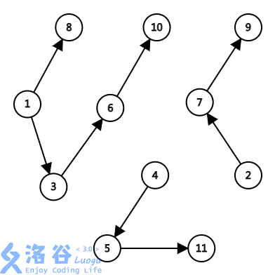

（然后就鸽日更了23333

今天的题


[洛谷P2765魔术球问题]: https://www.luogu.com.cn/problem/P2765	"P2765魔术球问题"


<!--more -->

#### 思路：

首先应该抽象出本题中隐藏的图：



图基于两个数之间的关系构造出（**a + b = i * i 且a < b 则从a到b有一条单向边**）

那么一个柱子就相当于一条单向路径。

题目要求就变成了：给出路径数n，求其能覆盖到的最多节点数

就是最小路径覆盖问题的逆向解

如何逆向？

考虑dinic+拆点。**每次向网络中增加一个（一对）点**，如果能找到增广路，说明其可以**归到之前已有的某个路径**中，此时不需要增加柱子，反之则需要增加柱子。

因为当有增广路时|G|与最大匹配数同时+1，此时最小路径覆盖不变。

**|G| - 最大匹配数 = 最小路径覆盖**

那么只需要每次加点后统计无法增广的次数N，N = n+1时得出的球数 ballNum - 1即是最大路径覆盖数

输出路径时只需要从每个路径的起点（**加入后无法增广的点**）遍历即可

> 需要注意的是：**题目可能有多解**
>
> 如上图的解就有：
>
> 1. 1 8 
>
>    2 7 9
>
>    3 6 10
>
>    4 5 11
>
> 2. 1 3 6 10
>
>    2 7 9
>
>    4 5 11
>
>    8
>
> 而样例只给出了一种，实际上两种方案都可以AC
>
#### 代码：

```c++
#include<bits/stdc++.h>
using namespace std;
struct Node;
struct Edge;
const int maxn = 1e5;
struct Node{
    int id,level;
    Edge* head;
    bool visited;
}nodes[maxn*2+2],S,T;
struct Edge {
    int flow,capicity;
    Edge* reverseEdge,*next;
    Node *from,*to;
    Edge(Node* from,Node* to,int capa):from(from),to(to),capicity(capa),flow(0),next(from->head){};// 初始化flow=0
};

inline void add(Node* f,Node* t,int c){
    f->head = new Edge(f,t,c);
    t->head = new Edge(t,f,0); //反向边容量0
    f->head->reverseEdge = t->head;
    t->head->reverseEdge = f->head;
}
int n , m;

struct Dinic{
    bool makeLevelGraph(Node *s,Node *t,int n){
        for(int i = 1;i <= n;i++){
            nodes[i].level = nodes[i+maxn].level = 0;
        }
        t->level = 0;
        t->id = 999;
        s->level = 1;
        queue<Node*> q;
        q.push(s);
        while(!q.empty()){
            Node* h = q.front();
            q.pop();
            // cout<<"head->"<<h->id<<"\n";
            for(Edge* e = h->head;e;e=e->next){
                if(e->to->level == 0 && e->flow < e->capicity){//两个条件：没有level、可增广
                    e->to->level = h->level+1;
                    // cout<<e->to->id<<"<--"<<h->level+1<<"\n";
                    if(e->to == t){
                        return true;
                    }
                    else q.push(e->to);
                }
            }
        }

        return false;
    }

    int dfs(Node* s,Node* t ,int limit = INT_MAX){
        if(s == t) return limit;
        
        for(Edge* e = s->head;e;e=e->next){
            if(e->to->level == s->level+1 && e->capicity > e->flow){
                int flow = dfs(e->to,t,min(limit,e->capicity - e->flow));
                if(flow > 0 ){
                    e->flow += flow;
                    e->reverseEdge->flow -= flow;
                    return flow;
                }
            }
        }
        return 0;
    }

    int operator ()(Node* s,Node* t,int n){
        int ans = 0;
        while(makeLevelGraph(s,t,n)){
            int flow = 0;
            while(flow = dfs(s,t)>0) ans += flow;
        }
        return ans;
    }
}dinic;

void printPath(Node* v){
    cout<<v->id<<" ";
    v->visited = true;
    for(Edge* e = v->head;e;e=e->next){
        if(e->flow == e->capicity && !nodes[e->to->id].visited && e->to->id!=0){
            printPath(&nodes[e->to->id<<1-1]);
        }
    }
}
int s[maxn];
int main (){
    int n;
    cin>>n;
    int stick = 0,ball = 0;
    while(stick <= n){
        ball++;
        nodes[ball].id = nodes[ball+maxn].id = ball;
        add(&S,&nodes[ball],1);
        add(&nodes[ball+maxn],&T,1);
        for(int i = sqrt(ball)+1;i < sqrt(ball*2);i++){
            add(&nodes[(i*i-ball)],&nodes[ball+maxn],1); //
        }
        int flow = dinic(&S,&T,ball); //每次增广
        if(!flow){
            // cout<<ball<<'\n';
            s[++stick] = ball;
        }
    } 
    cout<<ball-1<<"\n";
    S.visited = true;
    T.visited = true;
    for(int i = 1;i <= n ;i++){
        printPath(&nodes[s[i]]);
        cout<<"\n";
    }
    // 淦 多种方案
    return 0;
}
```

